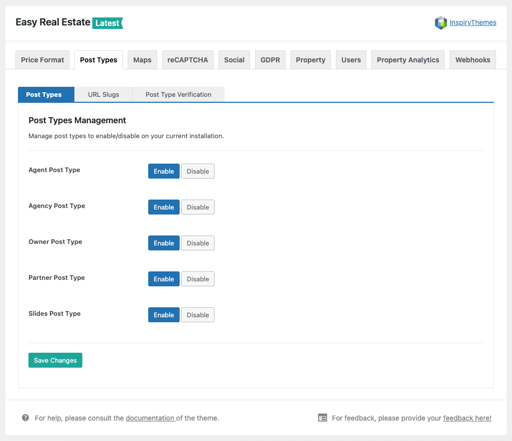

# Post Types Settings

The **Post Types** settings allow you to manage custom post types included in the Easy Real Estate plugin, which is a component plugin of RealHomes. You can **enable** or **disable** specific post types based on the requirements of your real estate website.

To access these settings:

1. Navigate to **Dashboard → Easy Real Estate → Settings**.
2. Click on the **Post Types** tab.
3. Under the **Post Types** sub-tab, you will see toggle options to **Enable** or **Disable** the following post types:
   - Agent Post Type
   - Agency Post Type
   - Owner Post Type
   - Partner Post Type
   - Slides Post Type

Simply click the appropriate **Enable** or **Disable** button for each post type according to your preferences.

After making changes, click the **Save Changes** button to apply the updates.

📌 **Important:**  
Once you've enabled or disabled any post type, it's highly recommended to **re-save your permalinks** to ensure proper URL behavior.  

You can do this by navigating to **Dashboard → Settings → Permalinks** and clicking the **Save Changes** button without making any modifications.