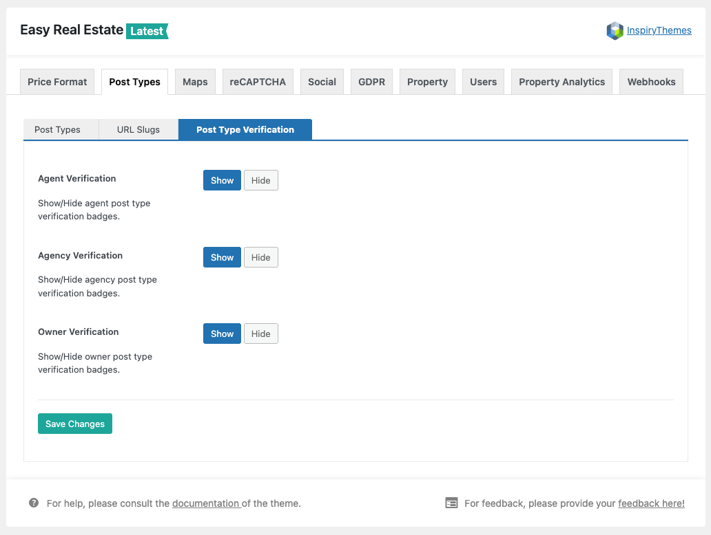

## Post Type Verification Settings

The **Post Type Verification** settings allow you to enable or disable verification badges for different user roles within your site. These badges are useful for building trust and authenticity by visually confirming the identity of agents, agencies, and owners.

### Available Options

#### 1. Agent Verification
- **Show**: Displays a verification badge on agent profiles and listings, indicating that the agent has been verified.  
- **Hide**: Removes the verification badge from all agent profiles and listings.

#### 2. Agency Verification
- **Show**: Displays a verification badge on agency profiles and their related listings.  
- **Hide**: Hides the verification badge from agency profiles.

#### 3. Owner Verification
- **Show**: Displays a verification badge on owner profiles and listings.  
- **Hide**: Hides the verification badge from all owner profiles.

---

### How to Use
1. Navigate to **Easy Real Estate → Post Types → Post Type Verification**.
2. Toggle between **Show** or **Hide** for each post type (Agent, Agency, Owner) depending on your preference.
3. Click **Save Changes** to apply your settings.

---

### Notes
- Verification badges help increase user trust by clearly showing which agents, agencies, or owners have been verified.  
- These badges appear on the front-end wherever the related profile or listing is displayed.  
- You can change these settings anytime without affecting the underlying user data.

