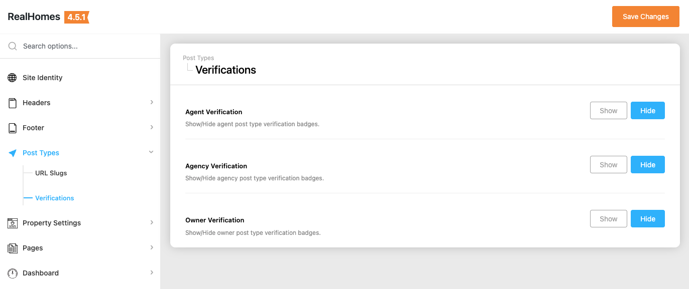
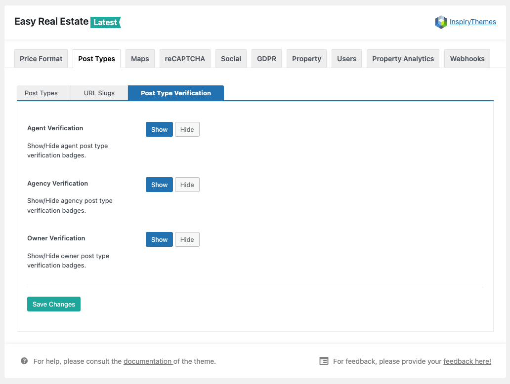

# Post Type Verification Settings

The **Post Type Verification** settings allow you to enable or disable verification badges for different user roles within your site. These badges are useful for building trust and authenticity by visually confirming the identity of agents, agencies, and owners.

To access and configure these settings, follow the navigation path based on your version of the **RealHomes** theme:

=== "v4.5.1 and Later"

    !!! success "RealHomes Settings"
        Dashboard ➤ RealHomes ➤ Settings ➤ Post Types** (tab) ➤ Post Type Verification** (sub-tab)

    

=== "v4.5.0 and Earlier"

    !!! info "Legacy Settings"
        Dashboard ➤ Easy Real Estate ➤ Settings ➤ Post Types** (tab) ➤ Post Type Verification** (tab)

    

### **Available Configuration Options**

Once you have navigated to the **Post Type Verification** section, you can toggle between **Show** or **Hide** for each of the following roles:

*   **Agent Verification**: Displays a verification badge on agent profiles and listings.
*   **Agency Verification**: Displays a verification badge on agency profiles and their related listings.
*   **Owner Verification**: Displays a verification badge on owner profiles and listings.

Simply click the appropriate button for each post type and click **Save Changes** to apply the updates.

---

!!! note "Trust & Authenticity"
    Verification badges help increase user trust by clearly showing which agents, agencies, or owners have been verified by the site administrator. These badges appear on the front-end wherever the related profile or listing is displayed.
