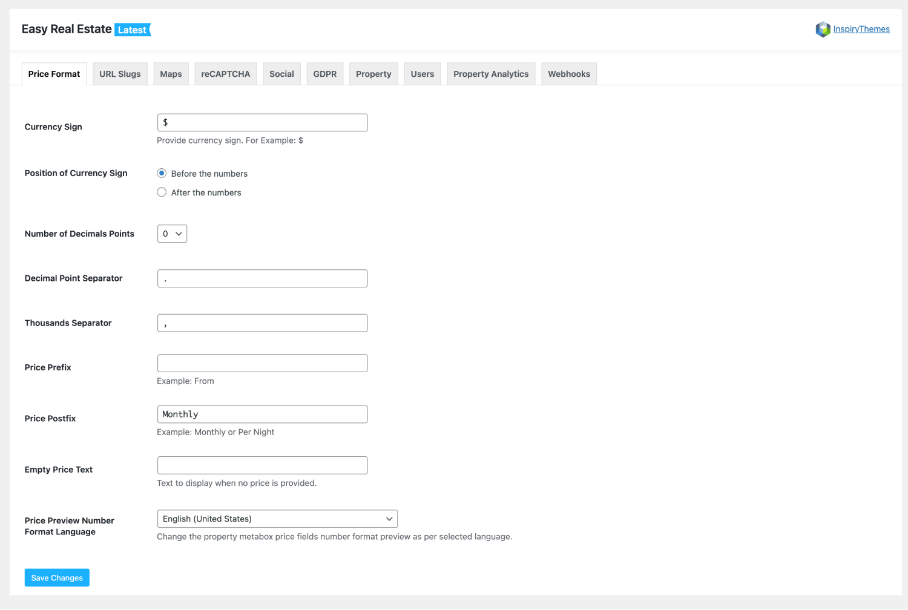

# Price Format Settings

For the price format settings, Navigate to **Easy Real Estate → Settings → Price Format**.

!!! warning
    If you are running the Real Homes theme older than {==3.9.0==} version then related settings can be found by navigating to **Dashboard → Real Homes → Customize Settings → Price Format**

These settings allow you to modify price to any format in the world.