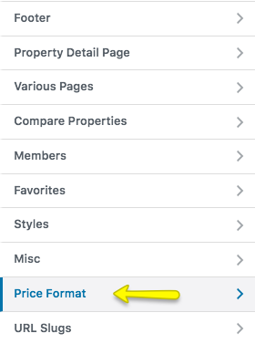
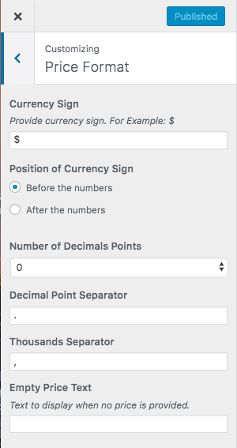

# Price Format Settings

To change price format, Navigate to **Dashboard → Appearance → Customize** and look for **Price Format** panel for related settings.

These settings allow you to modify price to any format in the world.

