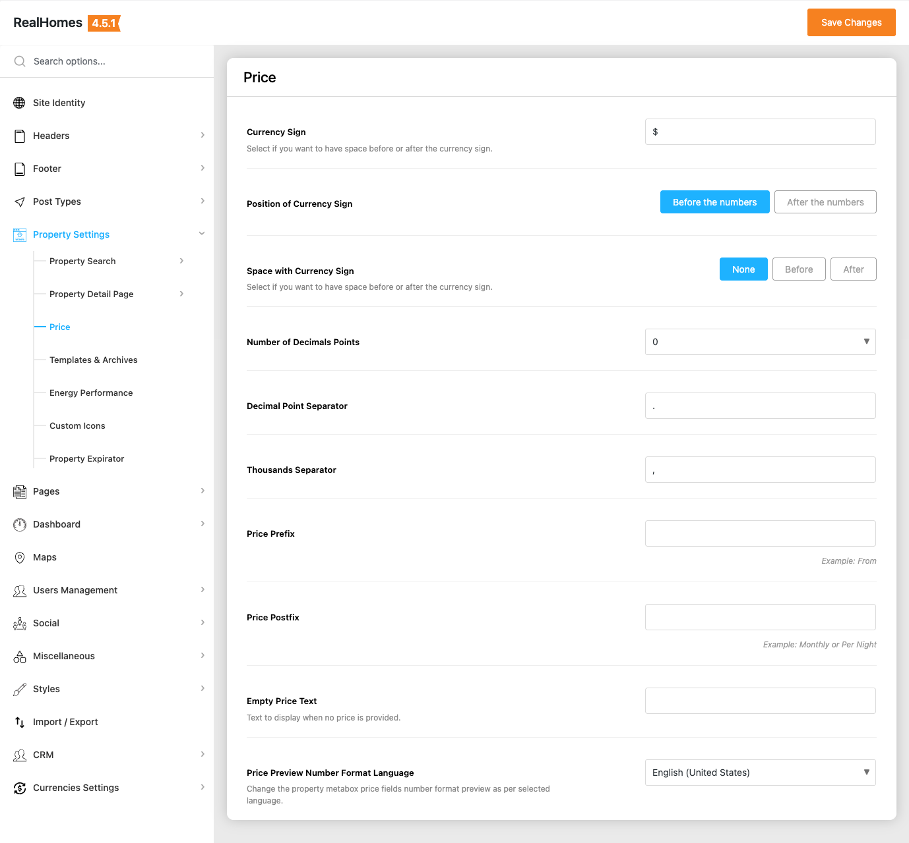
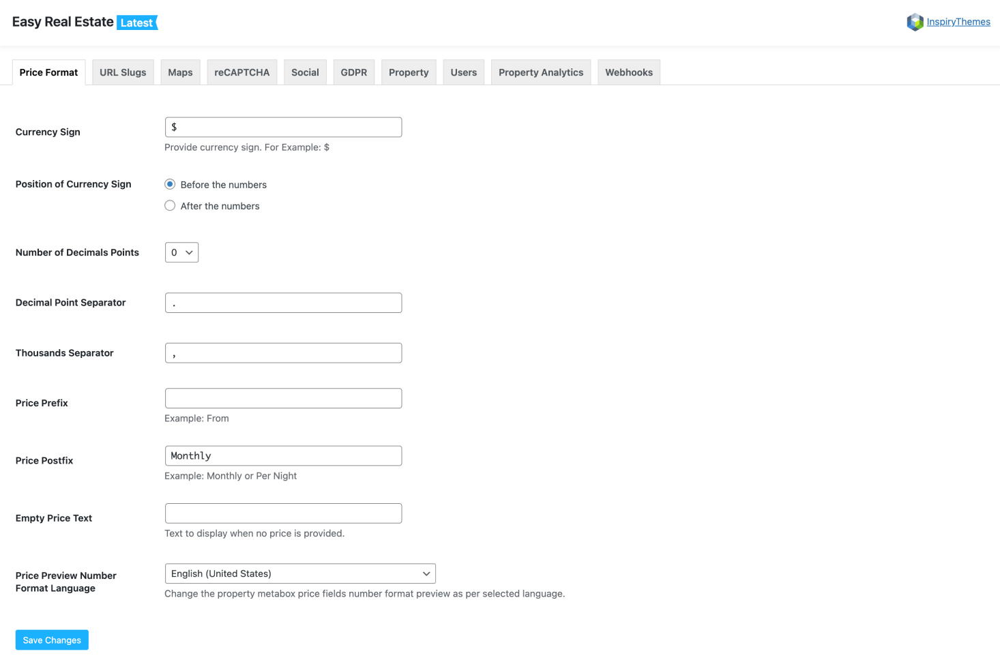

# Price Format Settings

The **Price Format** settings allow you to customize how property prices are displayed across your website, including currency signs, separators, and decimal points.

To access and configure these settings, follow the navigation path based on your version of the **RealHomes** theme:

---

### **v4.5.1 and Later**

!!! info "Navigation Path"
    **Dashboard** → **RealHomes** → **Settings** → **Price Format** (tab)

---

### **v4.5.0 and Earlier**

!!! info "Navigation Path"
    **Dashboard** → **Easy Real Estate** → **Settings** → **Price Format** (tab)

---

### **Available Configuration Options**

The Price Format settings let you customize how property prices appear across your website. Here’s a breakdown of the available options:

### 🪙 **Currency Sign**
Set the currency symbol you want to use (e.g., **$**, **€**, **AED**, etc.).

### ➡️ **Position of Currency Sign**
Choose whether the currency sign appears:
- **Before the numbers** (e.g., $1,000)
- **After the numbers** (e.g., 1,000$)

### ⬜ **Space with Currency Sign**
Choose whether to add a space between the currency symbol and the number:
- **None** – No space (e.g., $1000)
- **Before** – Space before the currency (e.g., `$ 1000`)
- **After** – Space after the currency (e.g., `1000 $`)

### 🔢 **Number of Decimals Points**
Set how many decimal places to show in prices. Common values:
- `0` – Whole numbers only (e.g., $1000)
- `2` – Prices like $1000.00

### 🔸 **Decimal Point Separator**
Define what character should be used to separate the decimal (e.g., `.` or `,`).

### 🔹 **Thousands Separator**
Choose how to separate thousands in prices (e.g., using `,` to display $1,000,000).

### 📝 **Price Prefix**
Optional text that appears **before** the price (e.g., "From").

### 📝 **Price Postfix**
Optional text that appears **after** the price (e.g., "per night", "monthly").

### 💬 **Empty Price Text**
Text shown when a price is not set for a property (e.g., "Contact for Price").

### 🌍 **Price Preview Number Format Language**
This changes the number format used in the property metabox based on your language/region (e.g., English - United States, French - France).

---

!!! note
    If you have enabled the **RealHomes Currency Switcher**, then the default format of the selected base currency will **override** the above settings.

---

!!! info "Legacy Versions (Older than 3.9.0)"
    If you are using a version of RealHomes older than **3.9.0**, the settings can be found at:  
    **Dashboard** → **RealHomes** → **Customize Settings** → **Price Format**