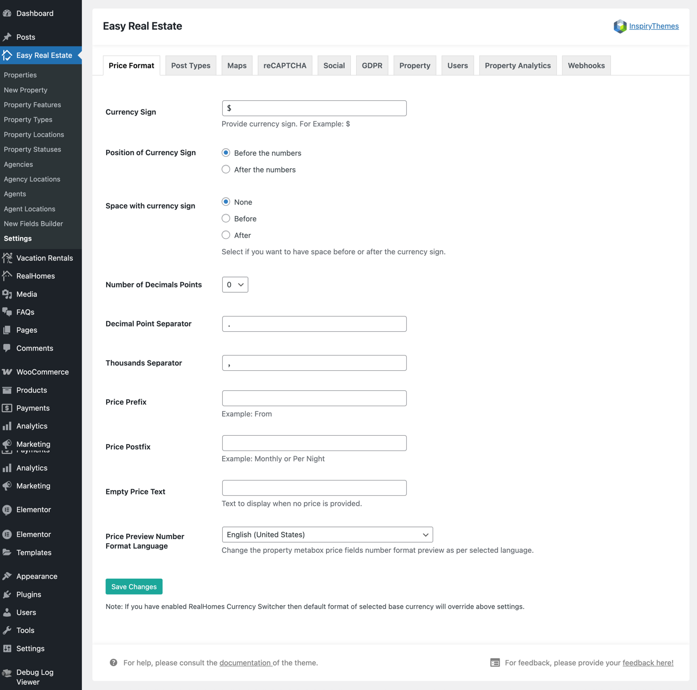

# Price Format Settings

To adjust how property prices are displayed on your website, navigate to:

**Dashboard → Easy Real Estate → Settings → Price Format**

!!! info "Important Information"
    If you are using a version of RealHomes older than **v3.9.0**, the price format settings can be found at:  
    **Dashboard → RealHomes → Customize Settings → Price Format**

The Price Format settings let you customize how property prices appear across your website. Here’s a breakdown of the available options:

---

### 🪙 **Currency Sign**
Set the currency symbol you want to use (e.g., **$**, **€**, **AED**, etc.).

### ➡️ **Position of Currency Sign**
Choose whether the currency sign appears:
- **Before the numbers** (e.g., $1,000)
- **After the numbers** (e.g., 1,000$)

### ⬜ **Space with Currency Sign**
Choose whether to add a space between the currency symbol and the number:
- **None** – No space (e.g., $1000)
- **Before** – Space before the currency (e.g., `$ 1000`)
- **After** – Space after the currency (e.g., `1000 $`)

### 🔢 **Number of Decimals Points**
Set how many decimal places to show in prices. Common values:
- `0` – Whole numbers only (e.g., $1000)
- `2` – Prices like $1000.00

### 🔸 **Decimal Point Separator**
Define what character should be used to separate the decimal (e.g., `.` or `,`).

### 🔹 **Thousands Separator**
Choose how to separate thousands in prices (e.g., using `,` to display $1,000,000).

### 📝 **Price Prefix**
Optional text that appears **before** the price (e.g., "From").

### 📝 **Price Postfix**
Optional text that appears **after** the price (e.g., "per night", "monthly").

### 💬 **Empty Price Text**
Text shown when a price is not set for a property (e.g., "Contact for Price").

### 🌍 **Price Preview Number Format Language**
This changes the number format used in the property metabox based on your language/region (e.g., English - United States, French - France).

---

!!! note
    If you have enabled the **RealHomes Currency Switcher**, then the default format of the selected base currency will **override** the above settings.