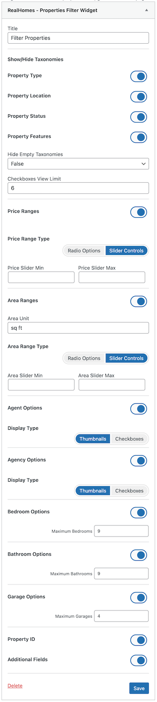

# Properties Filter Widget

## Properties Filter Widget on Backend

In RealHomes v4.1.0, we have added a new widget called **Properties Filters**. You can find this widget in the widgets section by going to **Dashboard → Appearance → Widgets**.

## Properties Filter in Action on Listing Pages

You can see the Properties Filters widget in action on the listing page in the following video:

<iframe width="100%" height="380" src="https://www.youtube.com/embed/TOLpNfSEdDs" title="YouTube video player" frameborder="0" allow="accelerometer; autoplay; clipboard-write; encrypted-media; gyroscope; picture-in-picture; web-share" allowfullscreen></iframe>
