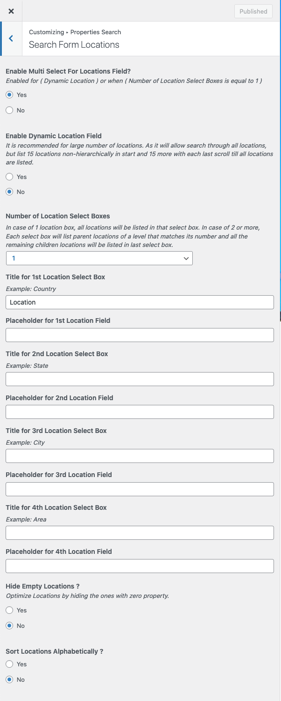
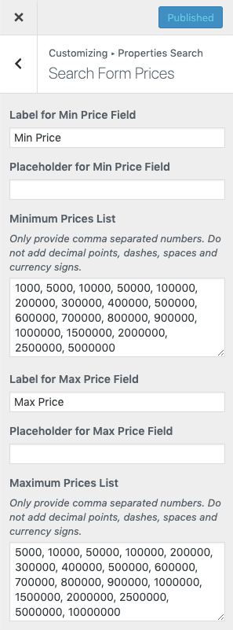
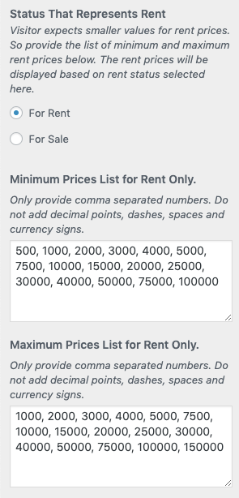

## Configure Property Search Settings

Before starting with this section, Make sure you have pretty permalinks enabled from **Dashboard → Settings → Permalinks** and Property Search Page is created.

Follow the steps below to configure the search functionality.

### Step 1. Select Property Search Page

Please navigate to **Dashboard → Real Homes → Customize Settings** and then go into **Properties Search → Properties Search Page** and select the Property Search Page. You can setup other options according to your requirements.

After this you will have a property search form displayed on homepage.

Now, you can also use the RealHomes - Advance Search Widget in sidebar as that widget uses the same configurations.

### Step 2. Show / Hide Fields and Search Form Labels

Navigate to Search Form Basics section in Properties Search panel, In this section you can show / hide fields on properties search form and you can also modify their labels.

### Step 3. Configure Locations Field

Properties Search panel contains a special section for Locations. Using which, Property location field in search form can be customized to fulfill your requirements.

First thing is to decide is the number of location boxes you need on search form. Do not worry too much about it as you can always change these settings in future to match your changing need.

Select 1 if you want to display all locations into one select box.

Select 2 if you want to display locations like **State → City OR City → Suburb**.

Select 3 if you want to display locations like **Country → State → City OR State → City → Suburb**

Select 4 if you want to display locations like **Country → State → City → Suburb**

After that you need to provide suitable labels for location boxes. You can provide these based on your own needs.

If you face any confusion, Simply make the changes in settings and preview them on homepage. Keep making the changes until you get what you want.

You can also Hide Empty Locations and Sort Locations Alphabetically. It means that if a location is not assigned to any property it won't be displayed in the location drop-down list.

### Step 4. Minimum and Maximum Values For Beds & Baths

Properties Search panel also contains a special section for Beds & Baths. Using which, Beds and Baths fields can be customized to your requirements.

In this section:

1) You can modify the Labels for the Beds & Baths Field.

2) You can also provide the values to be displayed in the drop-down lists for both fields.

3) You can modify the search behaviour for beds and baths to Minimum, Maximum or Equals.

### Step 5. Minimum and Maximum Values For Garages

Properties Search panel contains a special section for Garages. Using which, Garages fields can be customized to your requirements.

In this section:

1) You can modify the Labels for the Garages Field.

2) You can also provide the values to be displayed in the drop-down lists for this field.

3) You can modify the search behaviour for garages to Minimum, Maximum or Equals.

### Step 6. Minimum and Maximum Prices

Properties Search panel also contains a special section for Prices. Using which, Minimum and Maximum prices fields can be customized to your requirements.

### Step 7. Minimum and Maximum Area / Related Labels and Placeholder Texts

Properties Search panel contains a section for Area. Using which, Minimum and Maximum area fields can be customized to your requirements.

