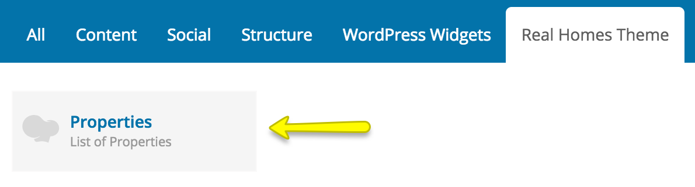
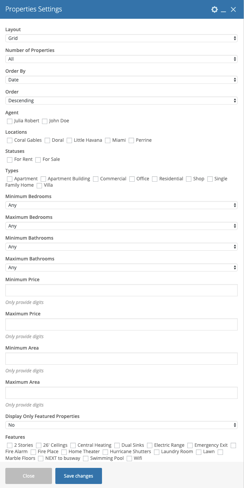

# Properties Short Code

`[properties]` short code facilitates you to display properties based on any filter you want at any page you want.

##Examples

###1st Example: 

`[properties count="4" layout="list" orderby="price" order="ASC" locations="miami" types="residential" statuses="for-sale" featured="no" agent="3"]`

###2nd Example:
 
`[properties count="6" layout="grid"]`

You can use the reference provided below to add attributes to properties shortcode.

|  Attribute  | Default Value  |  Description and Possible Values  |
|     ---     |  --- | --- |
| count	      | 3    | Number of properties to display. Example value: 4 |
| layout	  | grid | The layout in which you want properties to appear.  Possible values are "list" and "grid" |
| orderby	  | date | Sort properties by price or date.  Possible values are "price" and "date" |
| order	      | DESC | Provide the sort order descending or ascending.  Possible values are "DESC" and "ASC" |
| locations	  | null | Display properties belonging to certain locations.  You can provide single or comma separated values of property cities ( locations ) slugs.  You can get slugs information from "Properties → Property Cities" and look for slug column in front of property city names.  Example:  single value ( locations="miami" )  multiple values ( locations="broward-county,coral-gables,hollywood" ) |
| statuses    |	null | Display properties having certain statuses.  You can provide single or comma separated values of property statuses slugs.  You can get slugs information from "Properties → Property Statuses" and look for slug column in front of property status names.  Example:  single value ( statuses="for-rent" )  multiple values ( statuses="for-rent,for-sale" ) |
| types	      | null | Display properties relating to certain types.  You can provide single or comma separated values of property types slugs.  You can get slugs information from "Properties → Property Types" and look for slug column in front of property type names.  Example:  single value ( types="residential" )  multiple values ( types="commercial,residential,single-family-home" ) |
| features	  | null | Display properties having certain features.  You can provide single or comma separated values of property features slugs.  You can get slugs information from "Properties → Property Features" and look for slug column in front of property feature names.  Example:  single value ( features="central-heating" )  multiple values ( features="2-stories,central-heating,electric-range" ) |
| min_beds	  | null | To display properties with beds greater than or equal to minimum beds value.  Example value: 1 |
| max_beds	  | null | To display properties with beds less than or equal to maximum beds value.  Example value: 5 |
| min_baths	  | null | To display properties with baths greater than or equal to minimum baths value.  Example value: 1 |
| max_baths	  | null | To display properties with baths less than or equal to maximum baths value.  Example value: 5 |
| min_price	  | null | To display properties with price greater than or equal to minimum price value.  Example value: 175000 ( only provide digits without any comma or dash ) |
| max_price	  | null | To display properties with price less than or equal to maximum price value.  Example value: 625000 ( only provide digits without any comma or dash ) |
| min_area	  | null | To display properties with area greater than or equal to minimum area value.  Example value: 250 ( only provide digits without any comma or dash ) |
| max_area	  | null | To display properties with area less than or equal to maximum area value.  Example value: 4500 ( only provide digits without any comma or dash )| 
| featured    | no   | To display featured properties. Possible values are "no" and "yes" |
| agent    | null   | To display properties by agent. Possible value should be the ID of the agent |

## Visual Composer Support

`[properties]` short code comes integrated with visual composer and if you have installed and activated visual composer then make sure you have enabled it from visual composer settings as displayed in screen shot below. 

Once enabled, You can view the properties element under the theme tab as displayed in screen shot below. 

Now, You can use all the supported attributes visually as displayed in screen shot below. 

