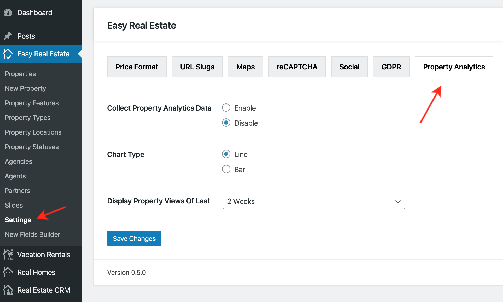

# Property Analytics Settings

To enable **Property Analytics** please navigate to **Easy Real Estate → Settings → Property Analytics** for related settings. As demonstrated in the screenshots below.

Once you enable **Property Analytics** feature, it will start gathering and displaying Property Views on properties detail pages.