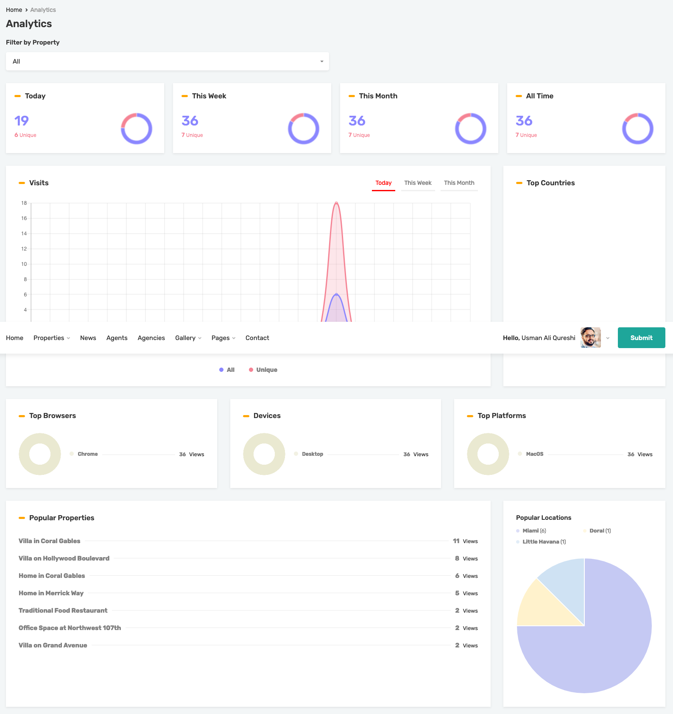

# Property Analytics

You can enable the **Property Analytics** dashboard module in **Dashboard → RealHomes → Customize Settings → Dashboard → Analytics** section.

The Property Analytics in the dashboard will look like this.

