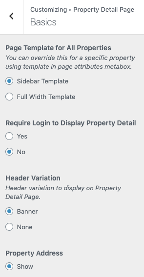
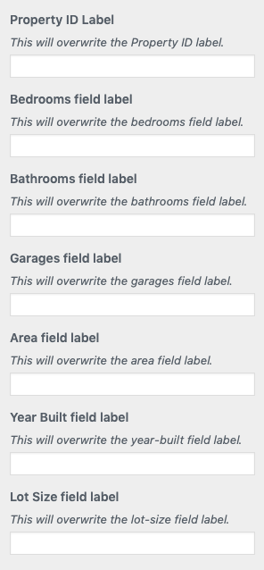

# Basic Settings of Property Detail Page

There are multiple options for property detail page in this section. To modify them go to **Dashboard → Appearance → Customize → Property Detail Page → Basics**.

 

