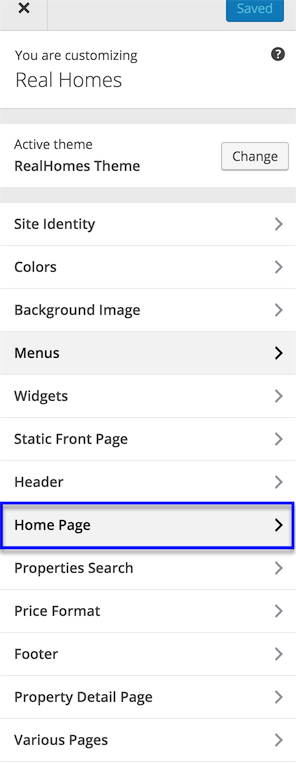

# Property Detail Page Settings

There are 10 types of different settings you can change for **Property Detail Pag**e (Single Property Page).

1. Breadcrumbs
2. Basics
3. Common Note
4. Video
5. Virtual Tour
6. Map
7. Attachments
8. Agent
9. Views
10. Similar Properties

To change any of the above settings you can go to “**Dashboard → Appearance → Customize → Property Detail Page**”.

