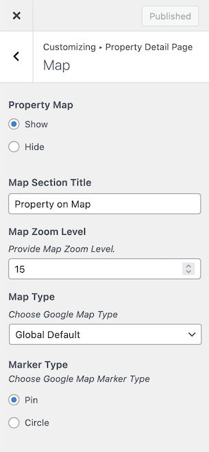

# Property Map on Property Detail Page

Property Map Settings can be found in **Dashboard → Appearance → Customize → Property Detail Page → Property Map**. You can either choose to display the google map or hide it.

Please note that you have to Configure Google Maps Api Key Settings to display the maps properly throughout your website.
