# Property Settings

## Intro

To change property settings, follow the navigation path based on your version of the **RealHomes** theme:

=== "v4.5.1 and Later"

    !!! success "RealHomes Settings"
        Dashboard ➤ RealHomes ➤ Settings ➤ Property Settings

=== "v4.5.0 and Earlier"

    !!! info "Legacy Settings"
        Dashboard ➤ RealHomes ➤ Customize Settings ➤ Property Detail Page

    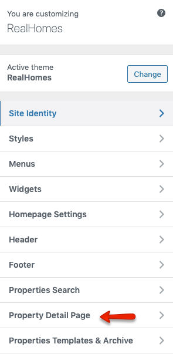

## Sections Manager

To reorder property detail page sections, navigate based on your version:

=== "v4.5.1 and Later"

    !!! success "RealHomes Settings"
        Dashboard ➤ RealHomes ➤ Settings ➤ Property Detail Page ➤ Section Manager

    

=== "v4.5.0 and Earlier"

    !!! info "Legacy Settings"
        Dashboard ➤ RealHomes ➤ Customize Settings ➤ Property Detail Page ➤ Sections Manager

    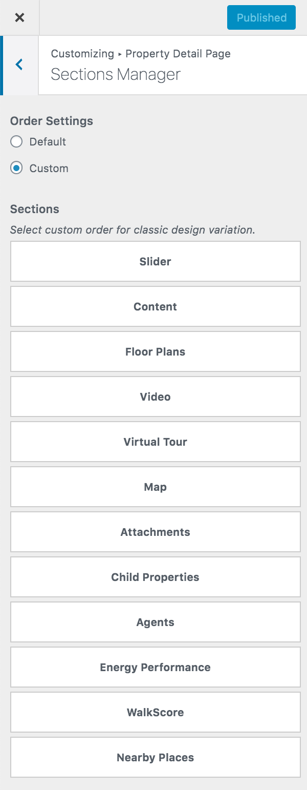

    **Modern**

    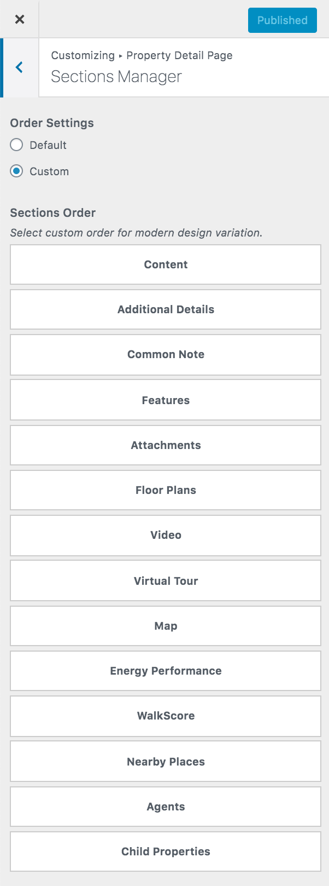

## Banner

The banner title settings can be modified in:

=== "v4.5.1 and Later"

    !!! success "RealHomes Settings"
        Dashboard ➤ RealHomes ➤ Settings ➤ Property Detail Page ➤ Banner

    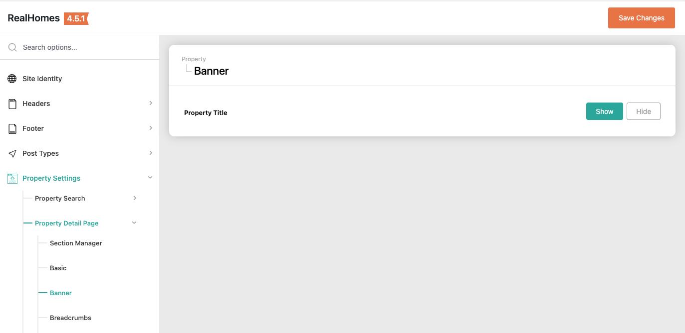

=== "v4.5.0 and Earlier"

    !!! info "Legacy Settings"
        Dashboard ➤ RealHomes ➤ Customize Settings ➤ Property Detail Page ➤ Banner

    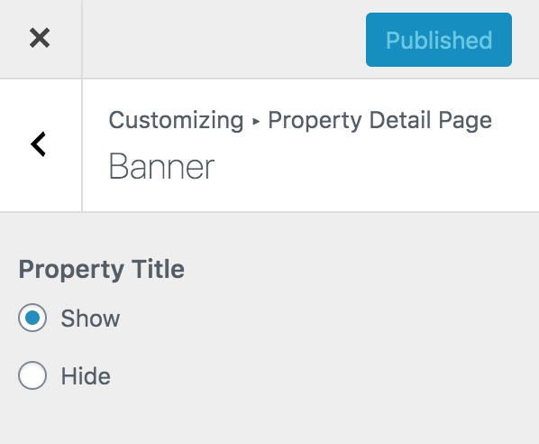

## Report Property

You can enable Report Property feature in:

=== "v4.5.1 and Later"

    !!! success "RealHomes Settings"
        Dashboard ➤ RealHomes ➤ Settings ➤ Property Detail Page ➤ Report Property

=== "v4.5.0 and Earlier"

    !!! info "Legacy Settings"
        Dashboard ➤ RealHomes ➤ Customize Settings ➤ Property Detail Page ➤ Report Property

    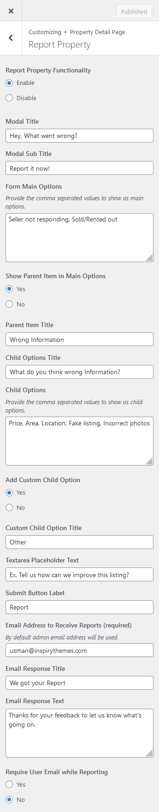

## Breadcrumbs

**Breadcrumb Settings** can be changed in:

=== "v4.5.1 and Later"

    !!! success "RealHomes Settings"
        Dashboard ➤ RealHomes ➤ Settings ➤ Property Detail Page ➤ Breadcrumbs

=== "v4.5.0 and Earlier"

    !!! info "Legacy Settings"
        Dashboard ➤ RealHomes ➤ Customize Settings ➤ Property Detail Page ➤ Breadcrumbs

    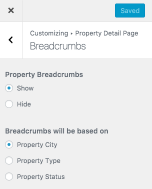 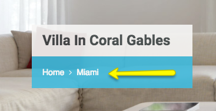

    **Modern**

     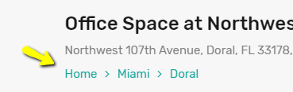

## Custom Header Template

You can also assign a Custom Header Template, which you can design with Elementor for Property Details page. This feature can be found in:

=== "v4.5.1 and Later"

    !!! success "RealHomes Settings"
        Dashboard ➤ RealHomes ➤ Settings ➤ Property Detail Page ➤ Basic ➤ Custom Header Template

=== "v4.5.0 and Earlier"

    !!! info "Legacy Settings"
        Dashboard ➤ RealHomes ➤ Customize Settings ➤ Property Detail Page ➤ Basics ➤ Custom Header Template

    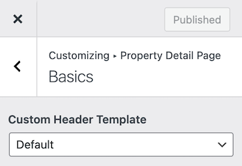

## Header Variation

**Header Variation** option is available in **Modern** Variation only.

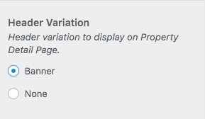

## Basic

There are multiple options for **Property Detail Page** in this section. To modify them navigate based on your version:

=== "v4.5.1 and Later"

    !!! success "RealHomes Settings"
        Dashboard ➤ RealHomes ➤ Settings ➤ Property Detail Page ➤ Basic

=== "v4.5.0 and Earlier"

    !!! info "Legacy Settings"
        Dashboard ➤ RealHomes ➤ Customize Settings ➤ Property Detail Page ➤ Basics

    You can over the default property detail page in the **Basic** section mentioned above.

    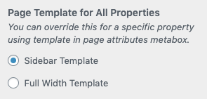

### **Single Property Variations**

We have added **5 New Property Detail Page Design Variations** for the property details page. Learn more in the following video.

<iframe width="100%" height="430" src="https://www.youtube.com/embed/0Rb8ajNRcN4" title="YouTube video player" frameborder="0" allow="accelerometer; autoplay; clipboard-write; encrypted-media; gyroscope; picture-in-picture" allowfullscreen></iframe>

### **Require Login to Display Property Detail Page**

You can choose to display the content of property details page in the **Basic** section mentioned above.

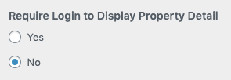

### **Property Address**

You can hide the property address in the **Basic** section mentioned above.

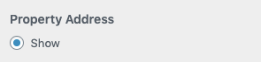

### **Guest Property View Limit**

This feature allows you to restrict how many property detail pages a guest (non-logged-in) user can view before being prompted to log in.

You can configure this under the **Basic** section mentioned above.

**Maximum Property Views for Guests**  
  Set the number of property detail pages a guest can view.

**Guest View Reset Interval**  
  Choose how often the guest view counter should reset:
  - Daily
  - Weekly
  - Every Two Weeks
  - Monthly
  - Forever

**Guest View Limit Alert – Page Title & Message**  
  Customize the title and message shown to guests when they exceed the viewing limit.

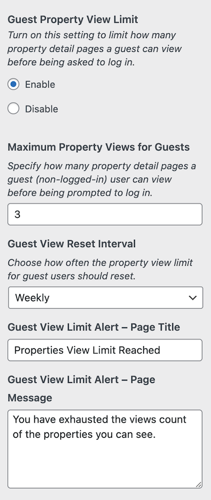

### **Section Labels**

You can modify the labels of all the sections in the **Basic** section mentioned above.

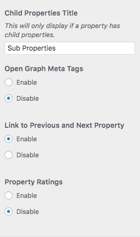

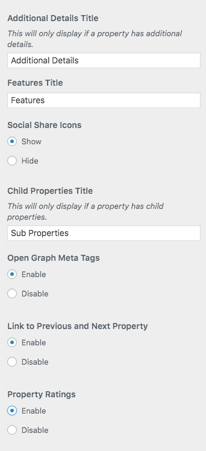

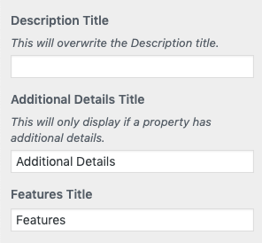

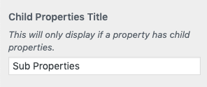

### **Open Graph Meta Tags**

You can enable or disable the Open Graph Meta Tags in the **Basic** section mentioned above. These Open Graph Meta Tags will help you display the property information while sharing a property on social media websites like facebook, twitter, etc.

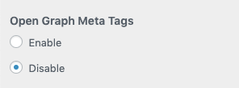

### **Next or Previous Property**

You can enable or disable the next or previous property buttons in the **Basic** section mentioned above.

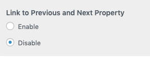

### **Property Ratings**

Property Ratings settings are available in the **Basic** section mentioned above.

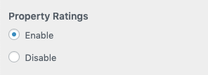

#### **Property Rating Styles**

You can modify the styles of property ratings in:

=== "v4.5.1 and Later"

    !!! success "RealHomes Settings"
        Dashboard ➤ RealHomes ➤ Settings ➤ Styles ➤ Miscellaneous

=== "v4.5.0 and Earlier"

    !!! info "Legacy Settings"
        Dashboard ➤ RealHomes ➤ Customize Settings ➤ Property Detail Page ➤ Gallery

!!! info
    You can override this setting for a specific property using **Property Meta Box** [here!](./add-property.md#add-gallery-images). 

### **Classic**

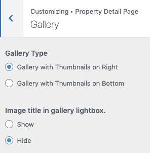

### **Modern**

Modern design has more **Gallery Types** than classic design. You can switch the **Gallery Types** in the **Gallery** section mentioned above.

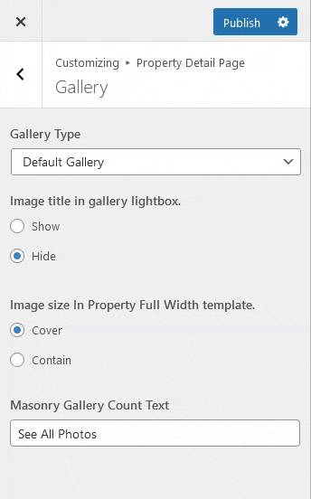

## **Social Share**

You can activate or deactivate the property share icons in:

=== "v4.5.1 and Later"

    !!! success "RealHomes Settings"
        Dashboard ➤ RealHomes ➤ Settings ➤ Property Detail Page ➤ Social

=== "v4.5.0 and Earlier"

    !!! info "Legacy Settings"
        Dashboard ➤ RealHomes ➤ Customize Settings ➤ Property Detail Page ➤ Social Share

    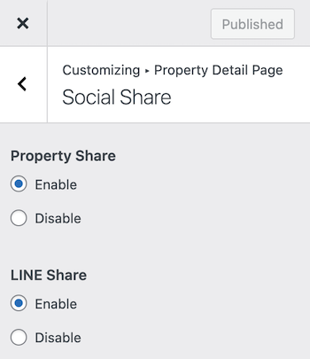

## Common Note

A common note can also be added on property page via:

=== "v4.5.1 and Later"

    !!! success "RealHomes Settings"
        Dashboard ➤ RealHomes ➤ Settings ➤ Property Detail Page ➤ Common Note

    Please note that this note will be displayed on every property page.

    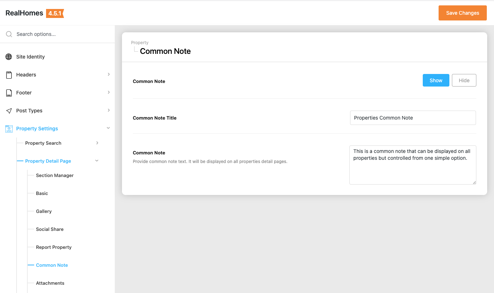

=== "v4.5.0 and Earlier"

    !!! info "Legacy Settings"
        Dashboard ➤ RealHomes ➤ Customize Settings ➤ Property Detail Page ➤ Common Note

    Please note that this note will be displayed on every property page.

    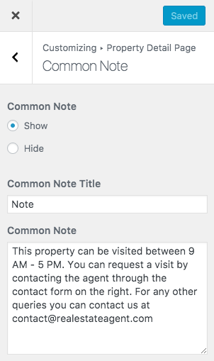

**Classic**

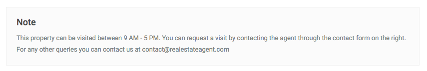

**Modern**

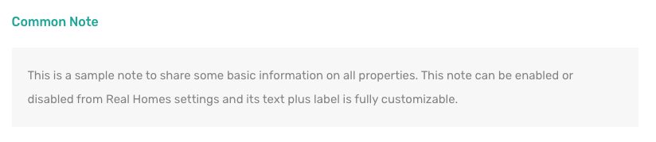

## Floor Plan

**Floor Plan Settings** are located in:

=== "v4.5.1 and Later"

    !!! success "RealHomes Settings"
        Dashboard ➤ RealHomes ➤ Settings ➤ Property Detail Page ➤ Floor Plans

=== "v4.5.0 and Earlier"

    !!! info "Legacy Settings"
        Dashboard ➤ RealHomes ➤ Customize Settings ➤ Property Detail Page ➤ Floor Plan

    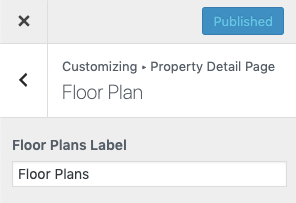

## Video

**Property Video Settings** are located in:

=== "v4.5.1 and Later"

    !!! success "RealHomes Settings"
        Dashboard ➤ RealHomes ➤ Settings ➤ Property Detail Page ➤ Video

    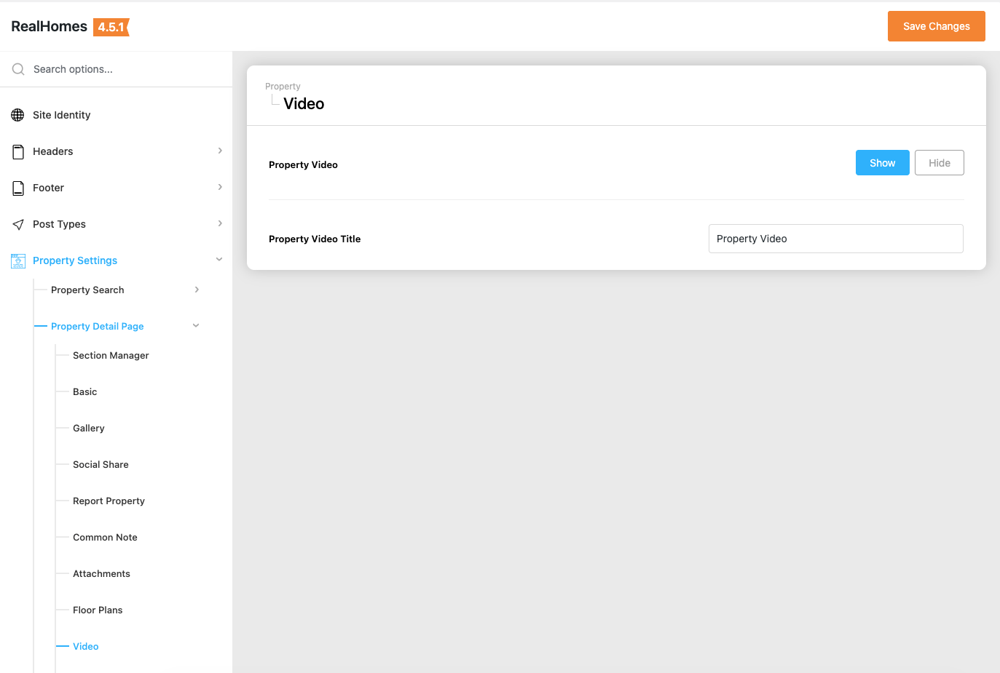

=== "v4.5.0 and Earlier"

    !!! info "Legacy Settings"
        Dashboard ➤ RealHomes ➤ Customize Settings ➤ Property Detail Page ➤ Video

    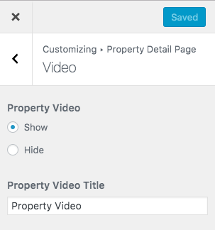

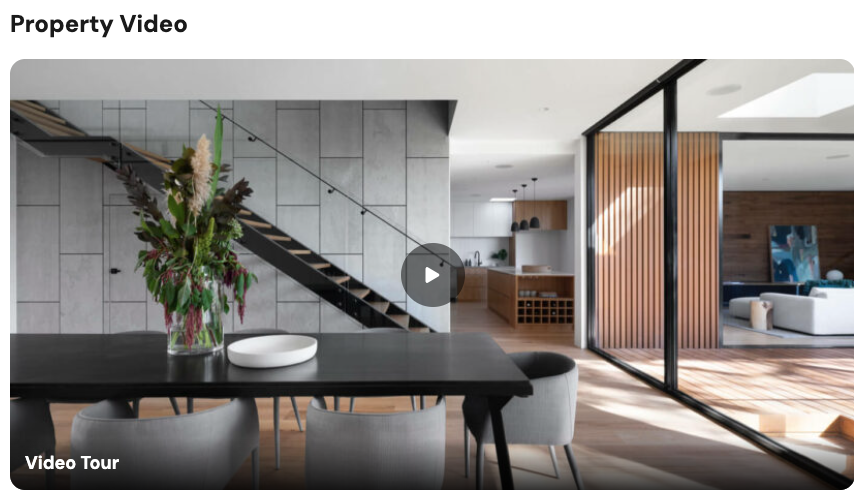

## Virtual Tour

**Property Virtual Tour Settings** are located in:

=== "v4.5.1 and Later"

    !!! success "RealHomes Settings"
        Dashboard ➤ RealHomes ➤ Settings ➤ Property Detail Page ➤ Virtual Tour

    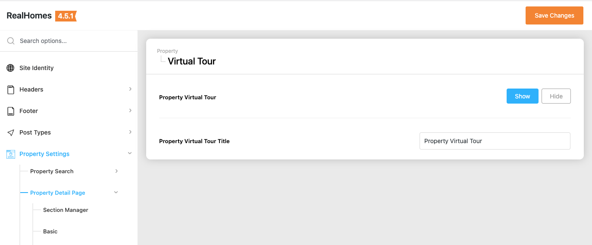

=== "v4.5.0 and Earlier"

    !!! info "Legacy Settings"
        Dashboard ➤ RealHomes ➤ Customize Settings ➤ Property Detail Page ➤ Virtual Tour

    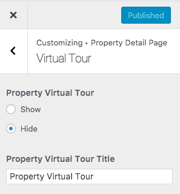

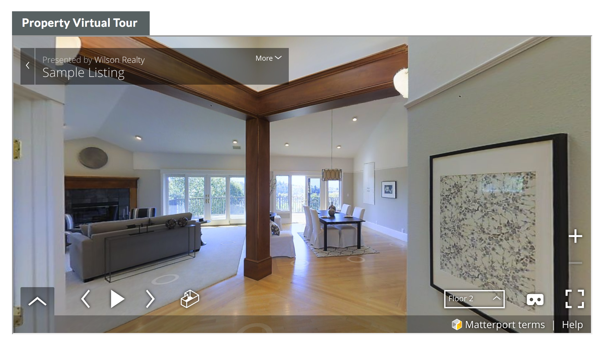

## Map

**Property Map Settings** can be found in:

=== "v4.5.1 and Later"

    !!! success "RealHomes Settings"
        Dashboard ➤ RealHomes ➤ Settings ➤ Property Detail Page ➤ Map

    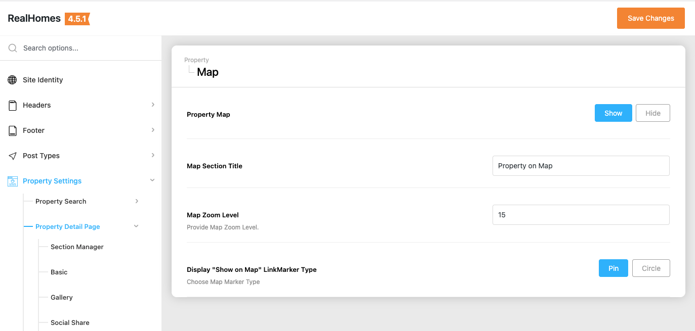

=== "v4.5.0 and Earlier"

    !!! info "Legacy Settings"
        Dashboard ➤ RealHomes ➤ Customize Settings ➤ Property Detail Page ➤ Property Map

    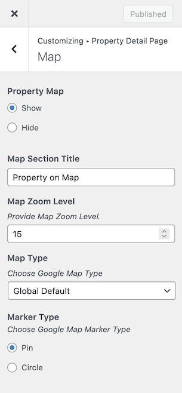

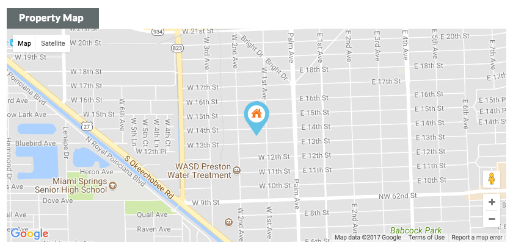

!!! note
    Please note that you have to Configure Google Maps API Key Settings in **Dashboard → RealHomes → Settings → Maps** section to display the maps properly throughout your website.

## WalkScore

First of all, get a **WalkScore API Key** by [**signing up with them**](https://www.walkscore.com/professional/api-sign-up.php) and then you can add it to **WalkScore Settings**.

**WalkScore Settings** can be found in:

=== "v4.5.1 and Later"

    !!! success "RealHomes Settings"
        Dashboard ➤ RealHomes ➤ Settings ➤ Property Detail Page ➤ WalkScore

    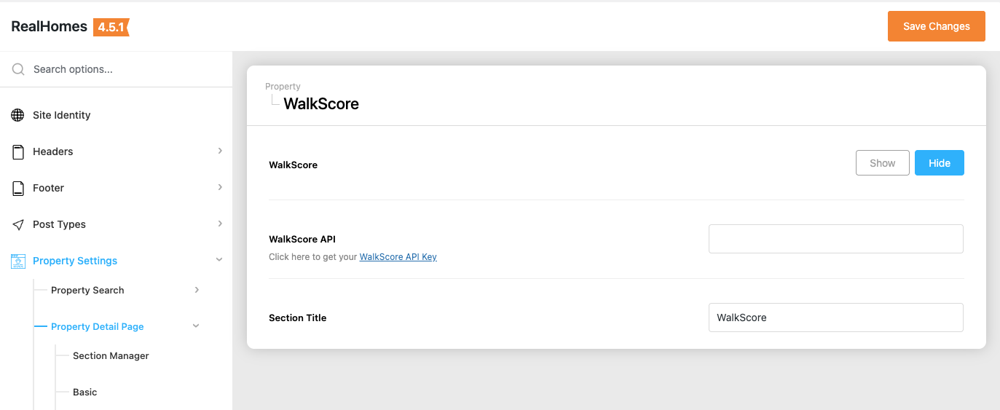

=== "v4.5.0 and Earlier"

    !!! info "Legacy Settings"
        Dashboard ➤ RealHomes ➤ Customize Settings ➤ Property Detail Page ➤ WalkScore

    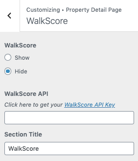

 **Classic**

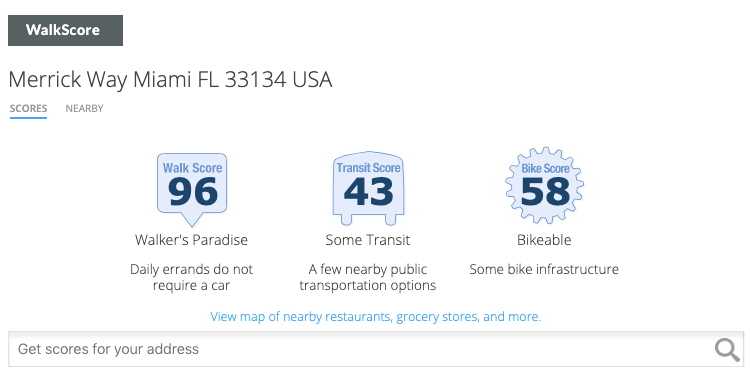

**Modern**

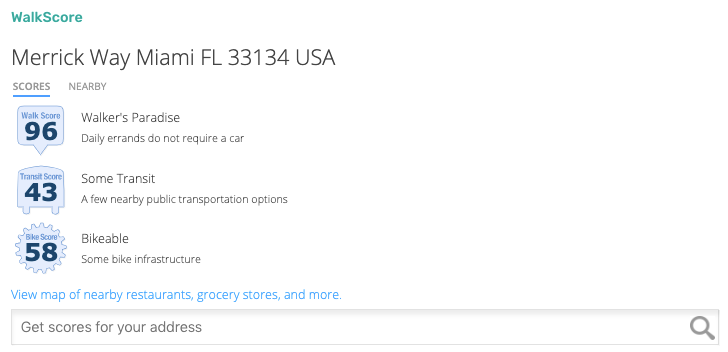

## Yelp Nearby Places

**Yelp Nearby Places Settings** can be found in:

=== "v4.5.1 and Later"

    !!! success "RealHomes Settings"
        Dashboard ➤ RealHomes ➤ Settings ➤ Property Detail Page ➤ Yelp

    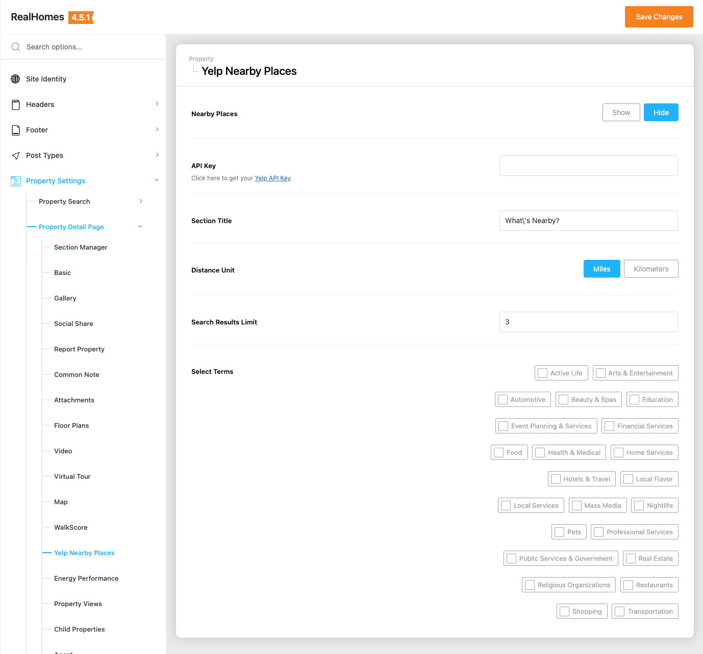

=== "v4.5.0 and Earlier"

    !!! info "Legacy Settings"
        Dashboard ➤ RealHomes ➤ Customize Settings ➤ Property Detail Page ➤ Yelp Nearby Places

    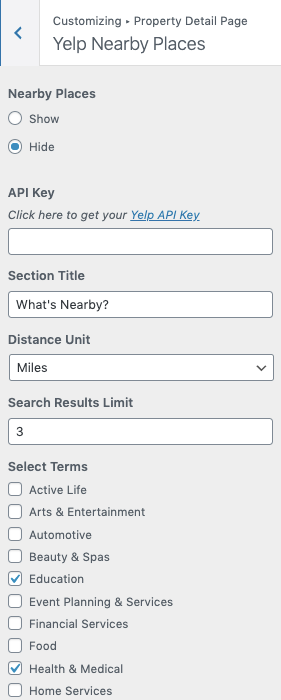

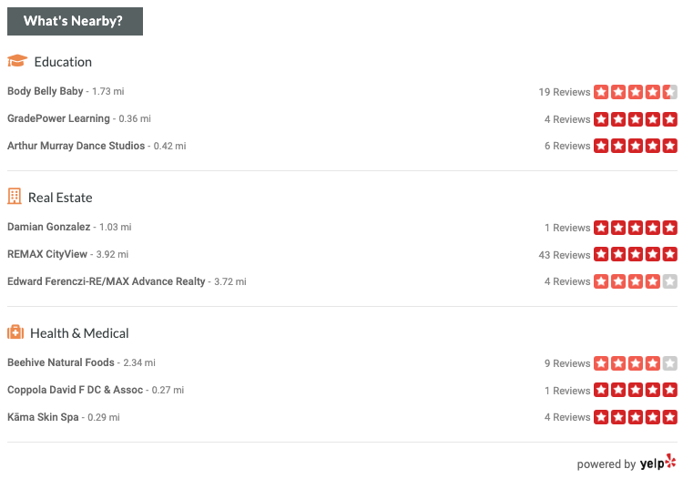

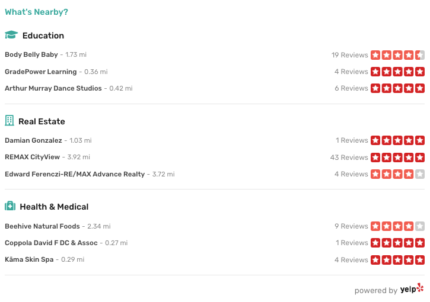

## Attachments

**Property Attachments Settings** can be found in:

=== "v4.5.1 and Later"

    !!! success "RealHomes Settings"
        Dashboard ➤ RealHomes ➤ Settings ➤ Property Detail Page ➤ Attachments

    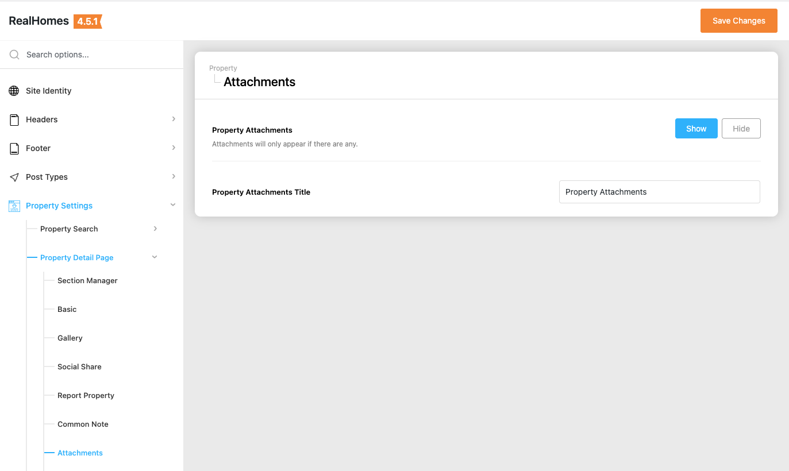

=== "v4.5.0 and Earlier"

    !!! info "Legacy Settings"
        Dashboard ➤ RealHomes ➤ Customize Settings ➤ Property Detail Page ➤ Attachments

    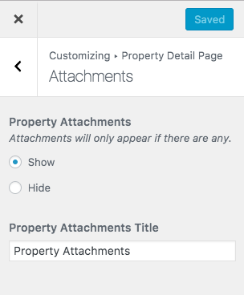

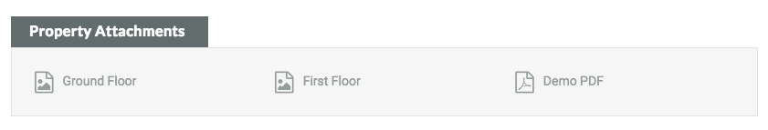

## Child Properties

**Child Properties Settings** can be found in:

=== "v4.5.1 and Later"

    !!! success "RealHomes Settings"
        Dashboard ➤ RealHomes ➤ Settings ➤ Property Detail Page ➤ Child Properties

    

=== "v4.5.0 and Earlier"

    !!! info "Legacy Settings"
        Dashboard ➤ RealHomes ➤ Customize Settings ➤ Property Detail Page ➤ Child Properties

    

**Classic**


**Modern**


## Agent

**Property Agent Settings** can be changed via:

=== "v4.5.1 and Later"

    !!! success "RealHomes Settings"
        Dashboard ➤ RealHomes ➤ Settings ➤ Property Detail Page ➤ Agent

    

=== "v4.5.0 and Earlier"

    !!! info "Legacy Settings"
        Dashboard ➤ RealHomes ➤ Customize Settings ➤ Property Detail Page ➤ Agent

    

    You can also show/hide contact form..

    

    

    

## Mortgage Calculator

The settings for **Mortgage Calculator** are located in:

=== "v4.5.1 and Later"

    !!! success "RealHomes Settings"
        Dashboard ➤ RealHomes ➤ Settings ➤ Property Detail Page ➤ Mortgage Calculator

    

=== "v4.5.0 and Earlier"

    !!! info "Legacy Settings"
        Dashboard ➤ RealHomes ➤ Customize Settings ➤ Property Detail Page ➤ Mortgage Calculator

    

    

    

## Schedule a Tour

The settings for **Schedule A Tour** are located in:

=== "v4.5.1 and Later"

    !!! success "RealHomes Settings"
        Dashboard ➤ RealHomes ➤ Settings ➤ Property Detail Page ➤ Schedule A Tour

    

=== "v4.5.0 and Earlier"

    !!! info "Legacy Settings"
        Dashboard ➤ RealHomes ➤ Customize Settings ➤ Property Detail Page ➤ Schedule A Tour

    

Please note that you can also manage the settings of **Schedule A Tour** while [adding/editing a property](https://realhomes.io/documentation/add-property/#schedule-a-tour).

## Energy Performance

**Energy Performance Settings** are located in:

=== "v4.5.1 and Later"

    !!! success "RealHomes Settings"
        Dashboard ➤ RealHomes ➤ Settings ➤ Property Detail Page ➤ Energy Performance

    

=== "v4.5.0 and Earlier"

    !!! info "Legacy Settings"
        Dashboard ➤ RealHomes ➤ Customize Settings ➤ Property Detail Page ➤ Energy Performance

    

## Energy Performance Class Settings

You can customize the **Classes of Energy Performance** section in the **Property Settings** of the theme.

=== "v4.5.1 and Later"

    !!! success "RealHomes Settings"
        Dashboard ➔ RealHomes ➔ Settings ➔ Property Settings ➔ Energy Performance

    

=== "v4.5.0 and Earlier"

    !!! info "Legacy Settings"
        Dashboard ➔ Easy Real Estate ➔ Settings ➔ Property

    

**Classic**


**Modern**


**Ultra**


## Property Views

Enable **Property Analytics** by navigating to the **Property Analytics** settings tab. Follow the path based on your version:

=== "v4.5.1 and Later"

    !!! success "RealHomes Settings"
        Dashboard ➔ RealHomes ➔ Settings ➔ Dashboard ➔ Property Analytics

    

=== "v4.5.0 and Earlier"

    !!! info "Legacy Settings"
        Dashboard ➔ Easy Real Estate ➔ Settings ➔ Property Analytics

    

After that go to the **Property Views** settings where you can Show/Hide and change the Label of *Property Views* section.

=== "v4.5.1 and Later"

    !!! success "RealHomes Settings"
        Dashboard ➤ RealHomes ➤ Settings ➤ Property Detail Page ➤ Property Views

    

=== "v4.5.0 and Earlier"

    !!! info "Legacy Settings"
        Dashboard ➤ RealHomes ➤ Customize Settings ➤ Property Detail Page ➤ Property Views

    

Once you enable **Property Views**, it will start gathering and displaying **Property Views** on **Properties Detail Pages**.

**Classic**


**Modern**


### **Analytics on Backend**

You can also track the Property Analytics at **Dashboard → Easy Real Estate → Properties**. You will see a new column displaying the views of all the properties in the system.


## Similar Properties

**Similar Properties Settings** are located in:

=== "v4.5.1 and Later"

    !!! success "RealHomes Settings"
        Dashboard ➤ RealHomes ➤ Settings ➤ Property Detail Page ➤ Similar Properties

    

=== "v4.5.0 and Earlier"

    !!! info "Legacy Settings"
        Dashboard ➤ RealHomes ➤ Customize Settings ➤ Property Detail Page ➤ Similar Properties

    * Just like all other settings for property detail page's elements you can choose to display the similar properties section on property detail page or hide it.
    * You can also select how similar properties will be selected based on their features, types, locations and status.
    * You can also sort the similar properties according to your own choice.

    

**Classic**


**Modern**


**Ultra**


## Property Booking

If you are using RealHomes Vacation Rentals feature, you can add the Property Booking Widget to Property Sidebar. To do this, please navigate to **Dashboard → Appearance → Widgets** and click on **RealHomes VR - Booking Widget** and select **Property Sidebar** and click **Add Widget** to add it to the Property Sidebar as demonstrated in the following screenshot.


## Availability Calendar

For the RealHomes Vacation Rentals feature, you can display the Availability Calendar by configuring its settings.

=== "v4.5.1 and Later"

    !!! success "RealHomes Settings"
        Dashboard ➤ RealHomes ➤ Settings ➤ Vacation Rentals ➤ Availability Calendar

    

=== "v4.5.0 and Earlier"

    !!! info "Legacy Settings"
        Dashboard ➤ RealHomes ➤ Customize Settings ➤ Property Detail Page ➤ Availability Calendar

    

## Vacation Rentals Features

You can find out more about RealHomes Vacation Rentals specific features by <a href="https://realhomes.io/documentation/add-property-vr/">clicking here</a>.

## Property Print Settings

Property print settings are located in:

=== "v4.5.1 and Later"

    !!! success "RealHomes Settings"
        Dashboard ➤ RealHomes ➤ Settings ➤ Property Detail Page ➤ Print

    

=== "v4.5.0 and Earlier"

    !!! info "Legacy Settings"
        Dashboard ➤ RealHomes ➤ Customize Settings ➤ Property Detail Page ➤ Print

    You can enable or disable any section of the single property page for print view. For example, if you disable the map for print view, then the map section will not be displayed while printing on paper.

    