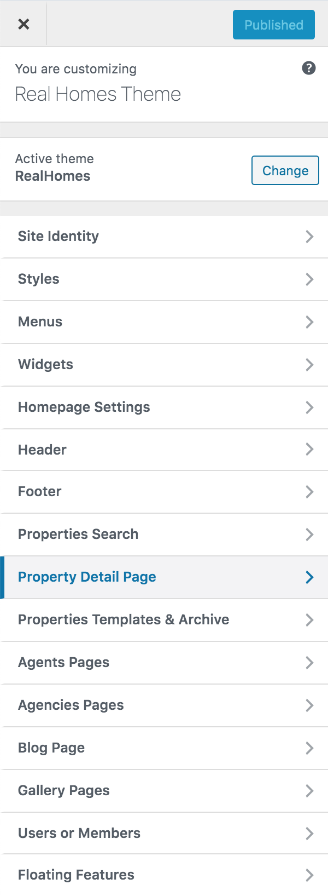
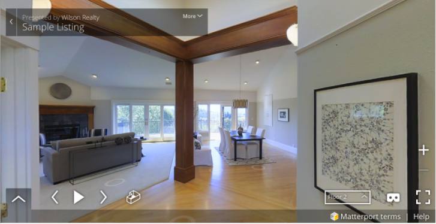
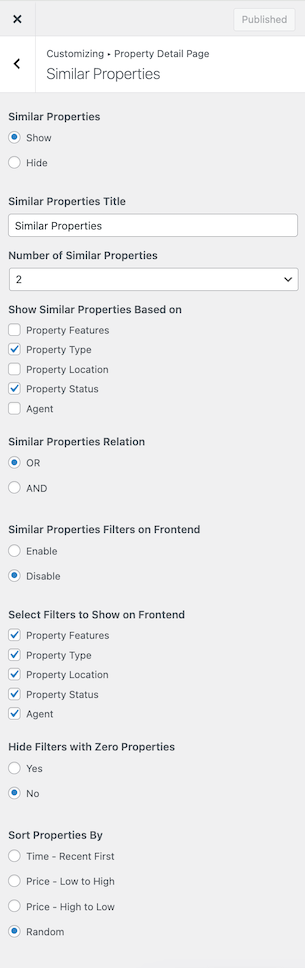

# Property Settings

## Intro

To change property settings you can go to “**Dashboard → Real Homes → Customize Settings → Property Detail Page**”.

## Breadcrumbs

Breadcrumb settings can be controlled via **Dashboard → Real Homes → Customize Settings → Property Detail Page → Breadcrumbs**.

 

**Note:-** Property Breadcrumbs are not available in **Modern** Variation.

## Basic

There are multiple options for property detail page in this section. To modify them go to **Dashboard → Real Homes → Customize Settings → Property Detail Page → Basics**.

**Header Variation** option is available in **Modern** Variation only.

## Common Note

A common note can also be added on property page via **Dashboard → Real Homes → Customize Settings → Property Detail Page → Common Note**. 

Please note that this note will be displayed on every property page.

**Classic**

**Modern**

## Video

Property Video Settings are located in **Dashboard → Real Homes → Customize Settings → Property Detail Page → Video**. You can either choose to display the video or hide it.

## Virtual Tour

Property Virtual Tour Settings are located in **Dashboard → Real Homes → Customize Settings → Property Detail Page → Virtual Tour**. You can either choose to display the virtual tour or hide it.

## Google Map

Property Map Settings can be found in **Dashboard → Real Homes → Customize Settings → Property Detail Page → Property Map**. You can either choose to display the google map or hide it.

**Please note that you have to Configure Google Maps Api Key Settings to display the maps properly throughout your website**.

## Attachments

**Property Attachments Settings** can be found in **Dashboard → Real Homes → Customize Settings → Property Detail Page → Attachments**. You can either choose to display the property attachment or hide them and the attachments can be in .jpg/.png/.pdf formats.

## Agent

**Property Agent Settings** can be changed via **Dashboard → Real Homes → Customize Settings → Property Detail Page → Agent**. You can either choose to display the agent on property detail page or hide this section. A copy of the message sent to agent can also be received by adding your email in "**Email Address to Get Copy**" and make sure to select "**Yes**" for the option which says "**Get Copy of Message Sent to Agent**".

You can also show/hide contact form in **Modern** Variation.

## Similar Properties on Property Detail Page

**Similar Properties Settings** are located in **Dashboard → Real Homes → Customize Settings → Property Detail Page → Similar Properties**.

* Just like all other settings for property detail page's elements you can choose to display the similar properties section on property detail page or hide it.
* You can also select how similar properties will be selected based on their features, types, locations and status.
* You can also sort the similar properties according to your own choice.

**Classic**

**Modern**

