# Property Settings

## Intro

To change property settings go to **Dashboard → RealHomes → Customize Settings → Property Detail Page**.

## Sections Manager

To reorder property detail page sections, go to **Dashboard → RealHomes → Customize Settings → Property Detail Page → Sections Manager**.

**Classic**

**Modern**

## Banner

The banner title settings can be modified in **Dashboard → RealHomes → Customize Settings → Property Detail Page → Banner**.

## Report Property

You can enable Report Property feature in **Dashboard → RealHomes → Customize Settings → Property Detail Page → Report Property**.

## Breadcrumbs

**Breadcrumb Settings** can be changed in **Dashboard → RealHomes → Customize Settings → Property Detail Page → Breadcrumbs**.

**Classic**

 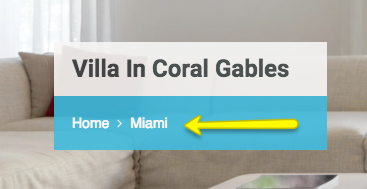

**Modern**

 

## Header Variation

**Header Variation** option is available in **Modern** Variation only.

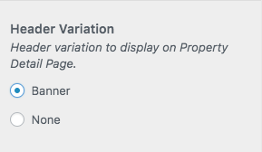

## Basic

There are multiple options for **Property Detail Page** in this section. To modify them go to **Dashboard → RealHomes → Customize Settings → Property Detail Page → Basics**.

### **Page Template Override**

You can over the default property detail page in **Dashboard → RealHomes → Customize Settings → Property Detail Page → Basics**.

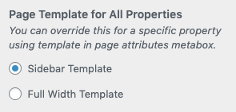

### **Single Property Variations**

We have added **5 New Property Detail Page Design Variations** for the property details page. Learn more in the following video.

<iframe width="100%" height="430" src="https://www.youtube.com/embed/0Rb8ajNRcN4" title="YouTube video player" frameborder="0" allow="accelerometer; autoplay; clipboard-write; encrypted-media; gyroscope; picture-in-picture" allowfullscreen></iframe>

### **Require Login to Display Property Detail Page**

You can choose to display the content of property details page in **Dashboard → RealHomes → Customize Settings → Property Detail Page → Basics**.

### **Property Address**

You can hide the property address in **Dashboard → RealHomes → Customize Settings → Property Detail Page → Basics**.

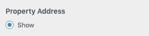

### **Section Labels**

You can modify the labels of all the sections in **Dashboard → RealHomes → Customize Settings → Property Detail Page → Basics**.

### **Property Share Icons**

You can activate or deactivate the property share icons in **Dashboard → RealHomes → Customize Settings → Property Detail Page → Basics**.

### **Open Graph Meta Tags**

You can enable or disable the Open Graph Meta Tags in **Dashboard → RealHomes → Customize Settings → Property Detail Page → Basics**. These Open Graph Meta Tags will help you display the property information while sharing a property on social media websites like facebook, twitter, etc.

### **Next or Previous Property**

You can enable or disable the next or previous property buttons in **Dashboard → RealHomes → Customize Settings → Property Detail Page → Basics**.

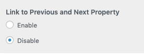

### **Property Ratings**

Property Ratings settings are available in **Dashboard → RealHomes → Customize Settings → Property Detail Page → Basics**.

## Gallery

Global option to change **Gallery Type** for all properties. This option is located in **Dashboard → RealHomes → Customize Settings → Property Detail Page → Gallery**. 

!!! info
    You can override this setting for a specific property using **Property Meta Box** [here!](./add-property.md#add-gallery-images). 

### **Classic**

### **Modern**

Modern design has more **Gallery Types** than classic design. You can switch the **Gallery Types** in **Dashboard → RealHomes → Customize Settings → Property Detail Page → Gallery**.

## Common Note

A common note can also be added on property page via **Dashboard → RealHomes → Customize Settings → Property Detail Page → Common Note**. 

Please note that this note will be displayed on every property page.

**Classic**

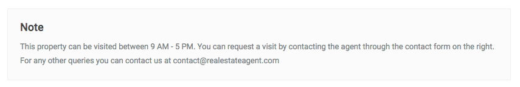

**Modern**

## Floor Plan

**Floor Plan Settings** are located in **Dashboard → RealHomes → Customize Settings → Property Detail Page → Floor Plan**.

## Video

**Property Video Settings** are located in **Dashboard → RealHomes → Customize Settings → Property Detail Page → Video**. You can either choose to display the video or hide it.

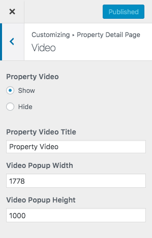

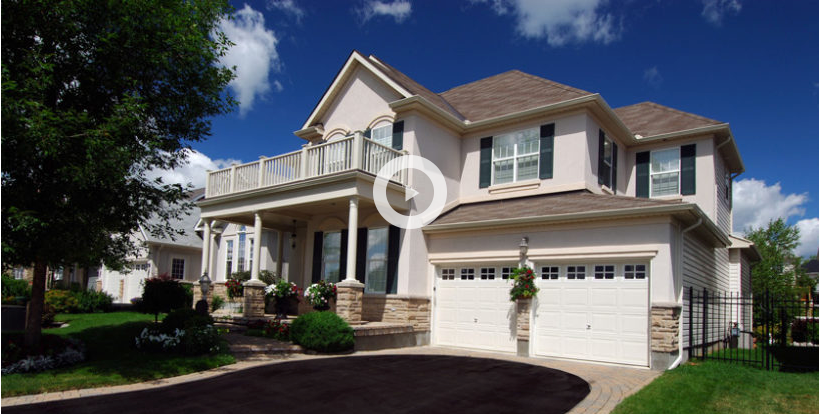

## Virtual Tour

**Property Virtual Tour Settings** are located in **Dashboard → RealHomes → Customize Settings → Property Detail Page → Virtual Tour**. You can either choose to display the virtual tour or hide it.

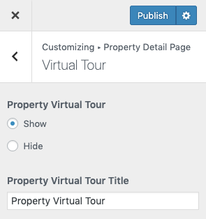

## Map

**Property Map Settings** can be found in **Dashboard → RealHomes → Customize Settings → Property Detail Page → Property Map**. You can either choose to display the google map or hide it.

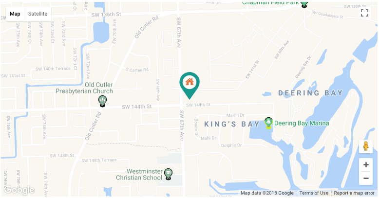

!!! note
    Please note that you have to Configure Google Maps API Key Settings in **Easy Real Estate → Settings → Maps** section to display the maps properly throughout your website.

## WalkScore

First of all, get a **WalkScore API Key** by [**signing up with them**](https://www.walkscore.com/professional/api-sign-up.php) and then you can add it to **WalkScore Settings** in **Customizer**.

**WalkScore Settings** can be found in **Dashboard → RealHomes → Customize Settings → Property Detail Page → WalkScore**.

 **Classic**

**Modern**

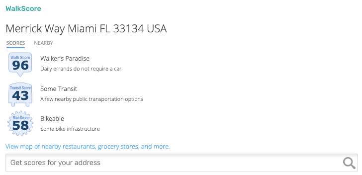

## Yelp Nearby Places

**Yelp Nearby Places Settings** can be found in **Dashboard → RealHomes → Customize Settings → Property Detail Page → Yelp Nearby Places**.

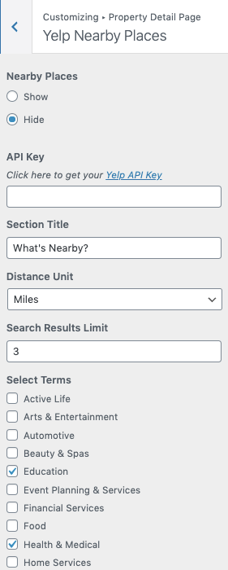

## Attachments

**Property Attachments Settings** can be found in **Dashboard → RealHomes → Customize Settings → Property Detail Page → Attachments**. You can either choose to display the property attachment or hide them and the attachments can be in .jpg/.png/.pdf formats.

## Child Properties

**Child Properties Settings** can be found in **Dashboard → RealHomes → Customize Settings → Property Detail Page → Child Properties**.

**Classic**

**Modern**

## Agent

**Property Agent Settings** can be changed via **Dashboard → RealHomes → Customize Settings → Property Detail Page → Agent**. You can either choose to display the agent on property detail page or hide this section along with its position in **Main Content** or **Sidebar**. A copy of the message sent to agent can also be received by adding your email in "**Email Address to Get Copy**" and make sure to select "**Yes**" for the option which says "**Get Copy of Message Sent to Agent**".

You can also show/hide contact form in **Modern** Variation.

## Mortgage Calculator

The settings for **Mortgage Calculator** are located in **Dashboard → RealHomes → Property Detail Page → Mortgage Calculator**. 

## Schedule a Tour

The settings for **Schedule A Tour** are located in **Dashboard → RealHomes → Property Detail Page → Schedule A Tour**. 

Please note that you can also manage the settings of **Schedule A Tour** while [adding/editing a property](https://realhomes.io/documentation/add-property/#schedule-a-tour).

## Energy Performance
**Energy Performance Settings** are located in **Dashboard → RealHomes → Property Detail Page → Energy Performance**.You can show/Hide Energy Performance section for the properties.

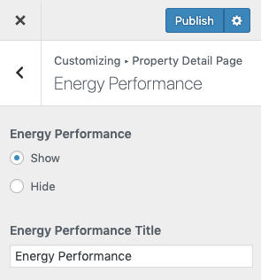

## Energy Performance Class Settings

You can customize the **Classes of Energy Performance** section in **Dashboard → Easy Real Estate → Settings → Property**.

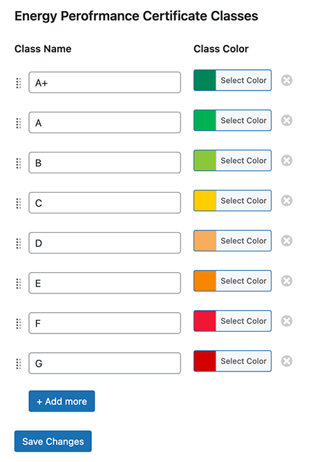

**Classic**

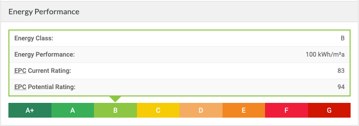

**Modern**

**Ultra**

## Property Views

Enable **Property Analytics** by navigating to **Easy Real Estate → Settings → Property Analytics** settings tab as displayed in the following screenshot.

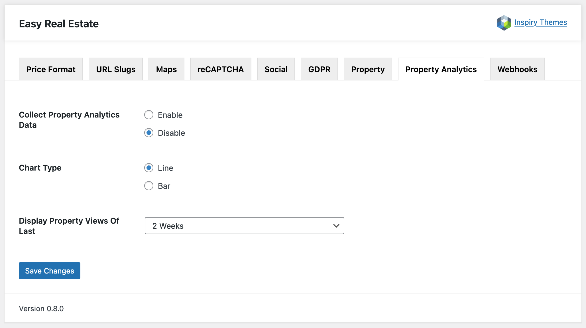

After that go to **Dashboard → RealHomes → Property Detail Page → Property Views**  where you can Show/Hide and change the Label of *Property Views* section.

Once you enable **Property Views**, it will start gathering and displaying **Property Views** on **Properties Detail Pages**.

**Classic**

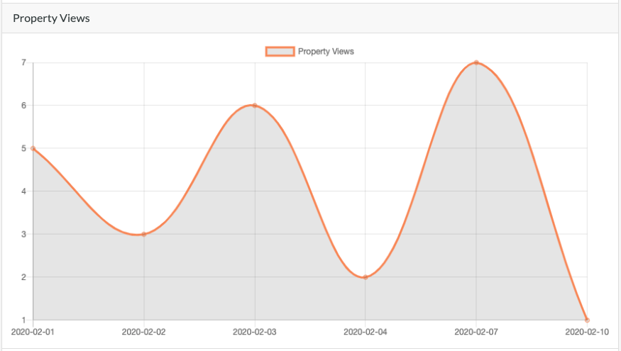

**Modern**

### **Analytics on Backend**

You can also track the Property Analytics at **Dashboard → Easy Real Estate → Properties**. You will see a new column displaying the views of all the properties in the system.

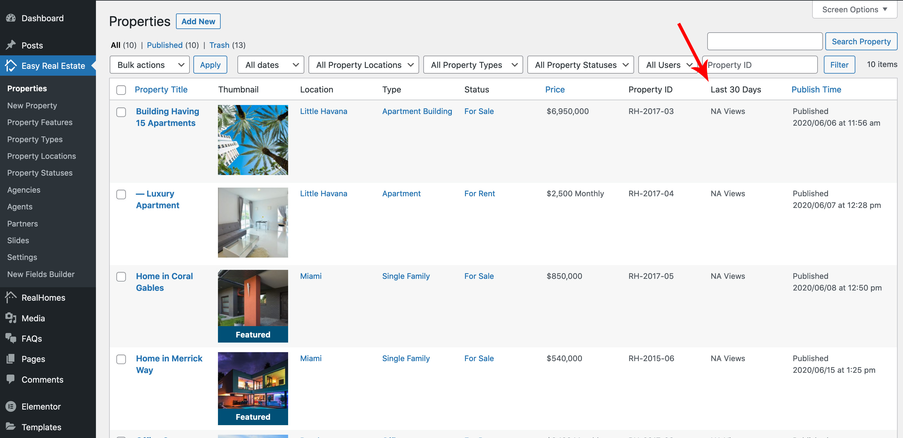
## Similar Properties

**Similar Properties Settings** are located in **Dashboard → RealHomes → Customize Settings → Property Detail Page → Similar Properties**.

* Just like all other settings for property detail page's elements you can choose to display the similar properties section on property detail page or hide it.
* You can also select how similar properties will be selected based on their features, types, locations and status.
* You can also sort the similar properties according to your own choice.

**Classic**

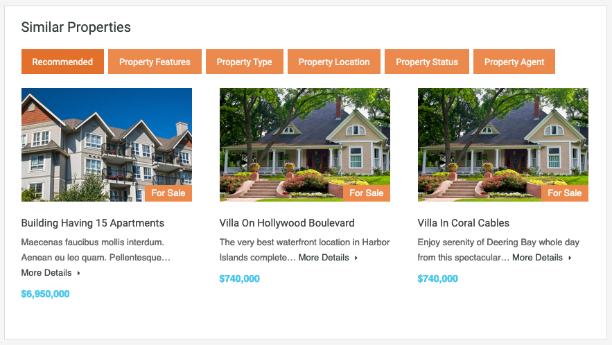

**Modern**

**Ultra**

## Property Booking

If you are using RealHomes Vacation Rentals feature, you can add the Property Booking Widget to Property Sidebar. To do this, please navigate to **Dashboard → Appearance → Widgets** and click on **RealHomes VR - Booking Widget** and select **Property Sidebar** and click **Add Widget** to add it to the Property Sidebar as demonstrated in the following screenshot.

## Availability Calendar

For RealHomes Vacation Rentals feautre, you can display Availability Calendar by configuring its settings in Customizer settings. To do that, navigate to **Dashboard → RealHomes → Customize Settings → Property Detail Page → Availability Calendar**.

## Vacation Rentals Features

You can find out more about RealHomes Vacation Rentals specific features by <a href="https://realhomes.io/documentation/add-property-vr/">clicking here</a>.

## Property Print Settings

Property print settings are located in **Dashboard → RealHomes → Customize Settings → Property Detail Page → Print** section.

You can enable or disable any section of the single property page for print view. For example, if you disable the map for print view, then the map section will not be displayed while printing on paper.

