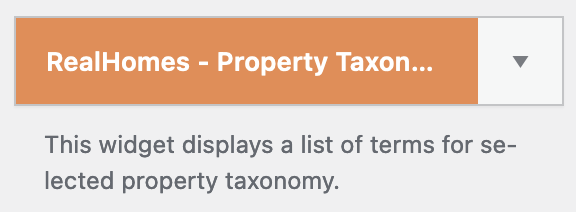
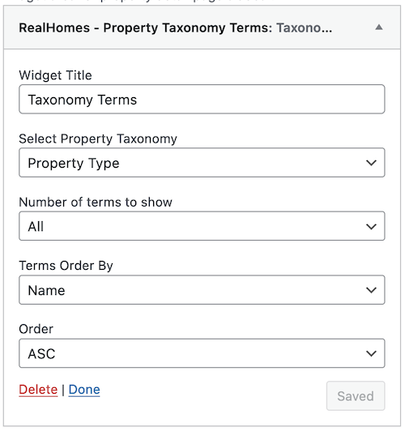
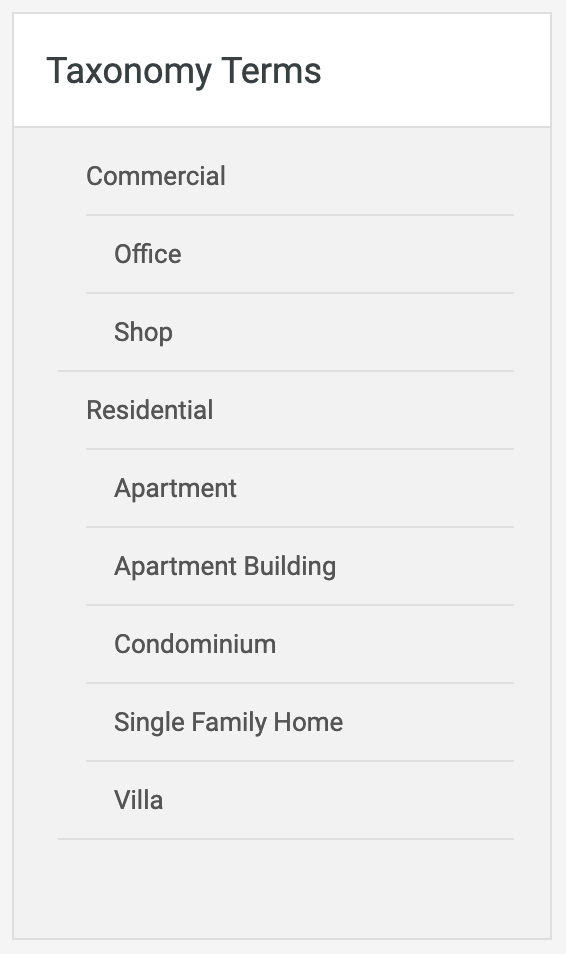
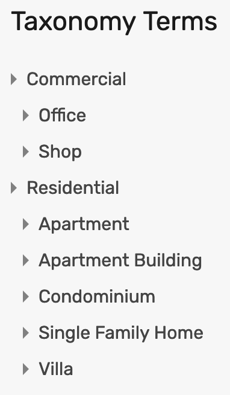
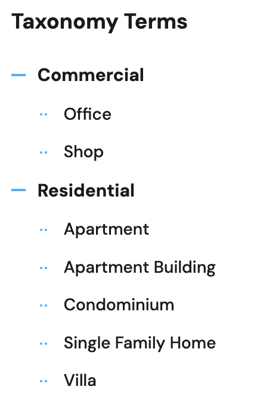

# Property Taxonomy Terms Widget

- Go to **Dashboard → Appearance → Widgets** and look for **RealHomes - Property Taxonomy Terms** widget. 

- Use that widget in a sidebar and provide its title, and set other options as per your choice.

- Now check out the front end of your site and you will have the **Property Taxonomy Terms** widget working. 

**Classic**  

**Modern**  

**Ultra**  

