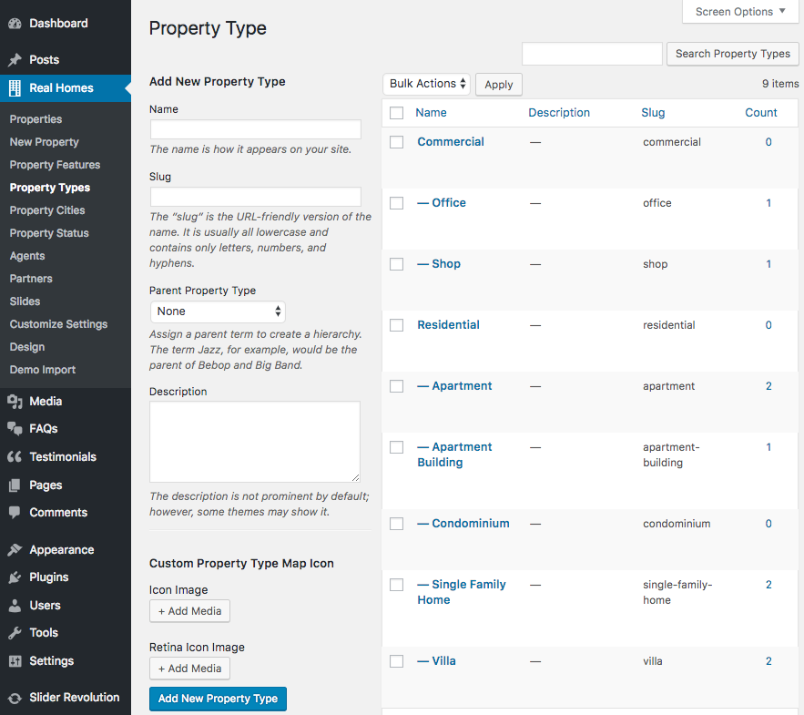

# Custom Marker For Property Type
### How to upload custom map marker for a property type

1. Go to **Dashboard → Properties → Property Types**.

2. Create a new property type or select an existing one.
 

3. Upload your marker using **Icon Image** option under **Property Map Icon**.

4. Upload a retina image of your marker using **Retina Icon Image** option.

5. These markers will now display on related property maps in place of default theme icons.

!!! note
    Recommended image size is 42px by 57px for map icon / 84px by 114px for retina map icon.
