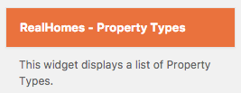

# Property Types Widget

- Go to **Dashboard → Appearance → Widgets** and look for **RealHomes - Property Types** widget. 

- Use that widget in a sidebar and provide its title. 

- Now check out the front end of your site and you will have the **Property Types** widget working. 

**Classic**  

**Modern**  

