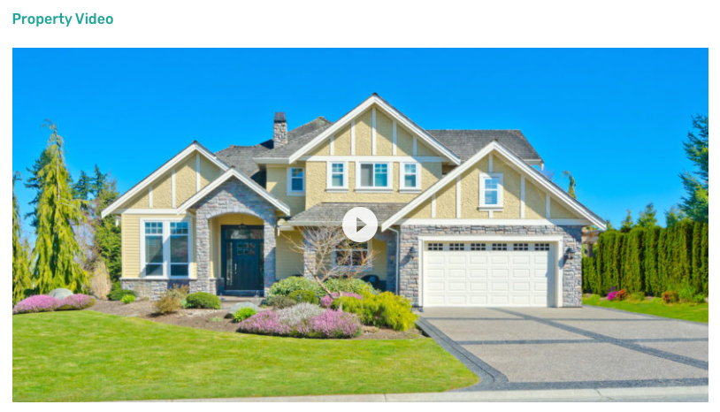

# Property Video on Property Detail Page

Property Video Settings are located in **Dashboard → Appearance → Customize → Property Detail Page → Video**. You can either choose to display the video or hide it.

