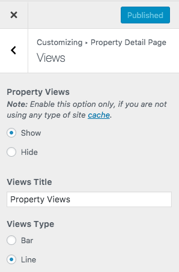
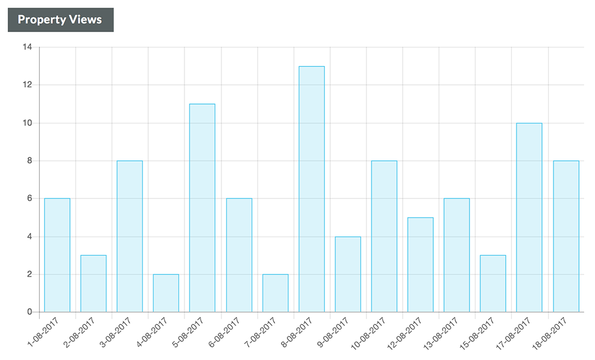
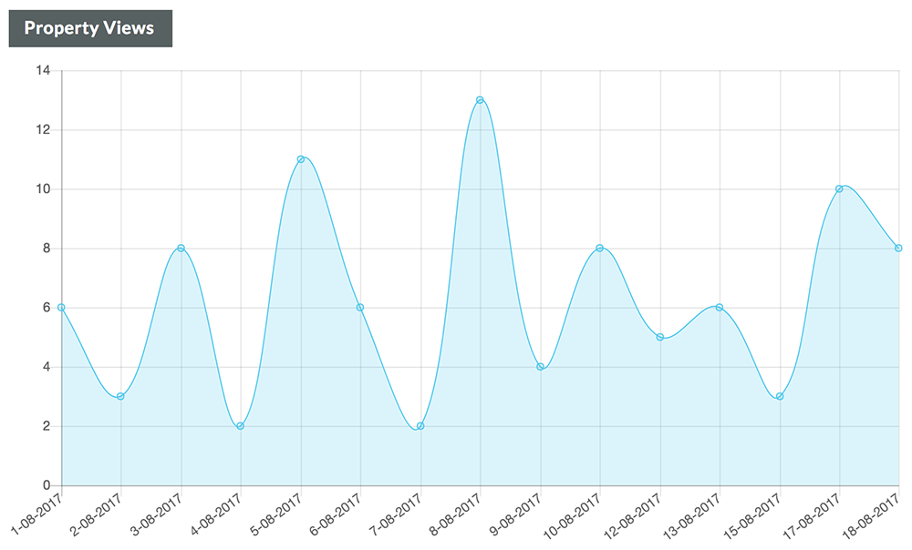

# Property Views on Property Detail Page

Property Views Settings can be changed via **Dashboard → Appearance → Customize → Property Detail Page → Views**.

1. You can choose to display the views on property detail page or hide this section.
2. You can choose the view type, i.e. either Bar or Line

**View Type: Bar**

**View Type: Line**

