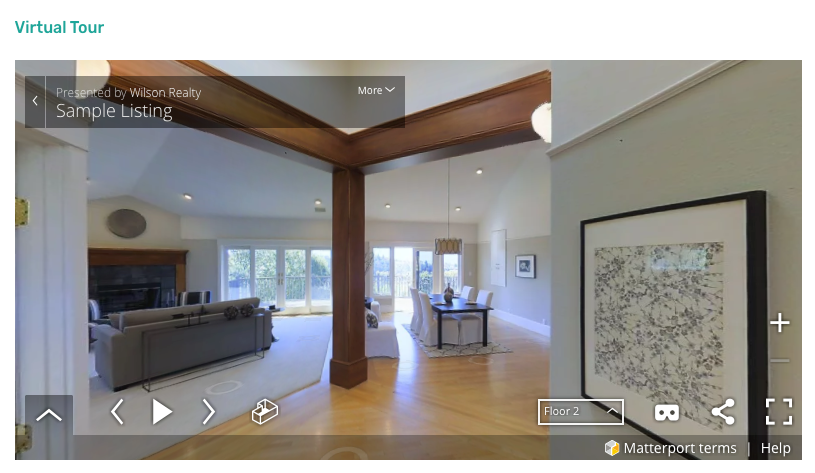

# Property Virtual Tour on Property Detail Page

Property Virtual Tour Settings are located in **Dashboard → Real Homes → Customize Settings → Property Detail Page → Virtual Tour**. You can either choose to display the virtual tour or hide it.

