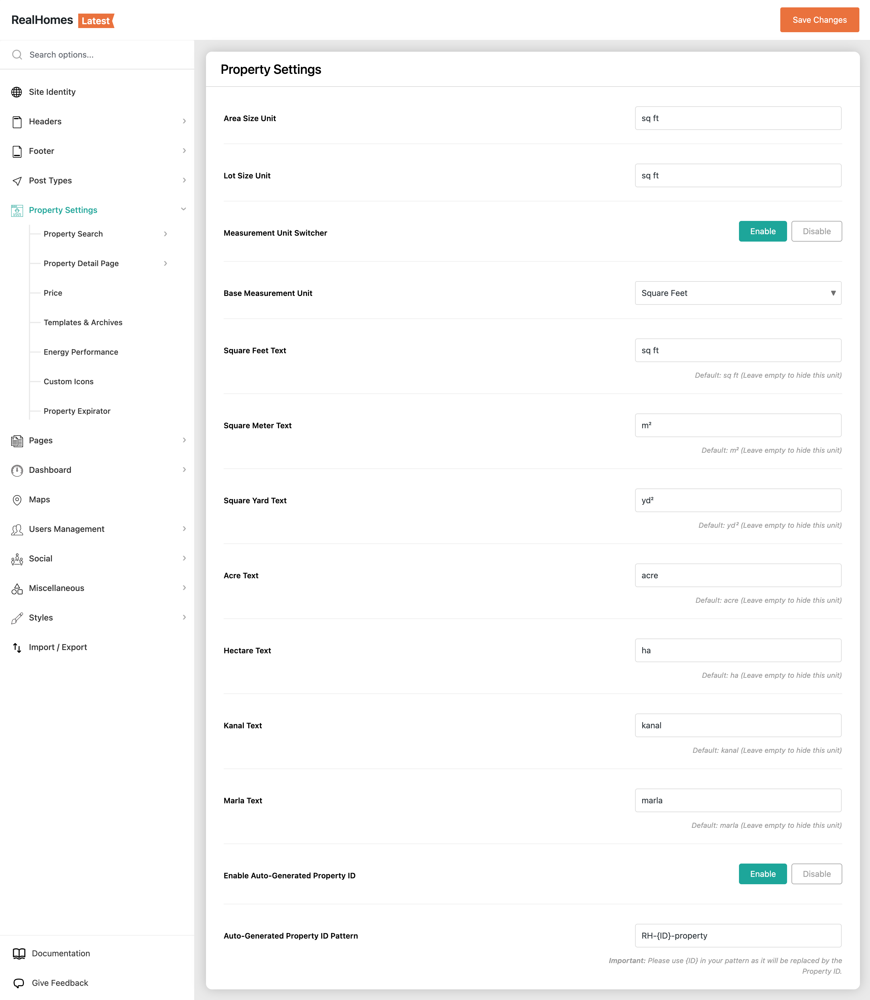
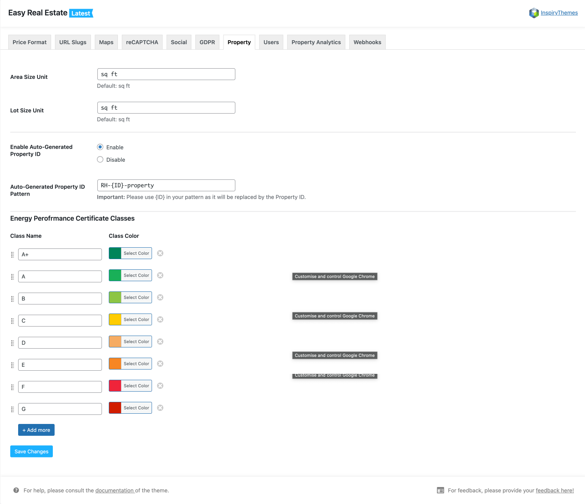

# Property Settings

The **Property Settings** allow you to configure essential property-related options, including area and lot size units, measurement unit switching, and auto-generated property IDs.

To access and configure these settings, follow the navigation path based on your version:

---

### **v4.5.1 and Later**

!!! info "Navigation Path"
    **Dashboard** → **RealHomes** → **Settings** → **Property Settings**

---

### **v4.5.0 and Earlier**

!!! info "Navigation Path"
    **Dashboard** → **Easy Real Estate** → **Settings** → **Property**

---

### **Area & Lot Size Units**

*   **Area Size Unit**: Specify the default unit for property area (e.g., `sq ft`, `m²`, `acres`, etc.). This unit will be used across all property listings for area fields.
*   **Lot Size Unit**: Define the unit for the lot size, which is separate from the area unit (e.g., `sq ft`, `m²`, etc.).

---

### **Measurement Unit Switcher**

If you are using the **Modern** or **Ultra** design, you can enable the dynamic **Measurement Unit Switcher**. When enabled, a dropdown or toggle will appear on frontend properties, allowing visitors to switch between different units dynamically (like Square Feet to Square Meters).

*   **Measurement Unit Switcher**: Toggle to **Enable** or **Disable**.
*   **Base Measurement Unit**: Select the measurement unit you used when entering your property sizes in the backend. All mathematical conversions for the frontend switcher will be calculated from this base unit.
*   **Customizing Unit Texts**: Below the base unit, you can modify the display labels for each available measurement unit (Square Feet, Square Meter, Square Yard, Acre, Hectare, Kanal, Marla). **If a unit's text field is left empty, that specific unit will be hidden** from the frontend switcher.

!!! note "Detailed Guide"
    For a more detailed explanation of how the unit conversions work, please refer to the [Measurement Unit Switcher](measurement-units.md) documentation.

---

### **Auto-Generated Property ID**

*   **Enable Auto-Generated Property ID**: Toggle to **Enable** to automatically generate a property ID when a new property is added, or **Disable** to require manual entry.
*   **Auto-Generated Property ID Pattern**: Define the pattern used for generating IDs. You must include `{ID}` in your pattern, which will be replaced logically with the actual property ID number.
    *   *Example:* `RH-{ID}-property` will output something like `RH-154-property`.

---

!!! info "Looking for Energy Performance Settings?"
    In RealHomes **v4.5.1 and Later**, the Energy Performance Category settings have been moved to their own dedicated sub-section at **Dashboard → RealHomes → Settings → Property Settings → Energy Performance**. In older versions (**v4.5.0 and Earlier**), they are located at the bottom of the **Property** tab.