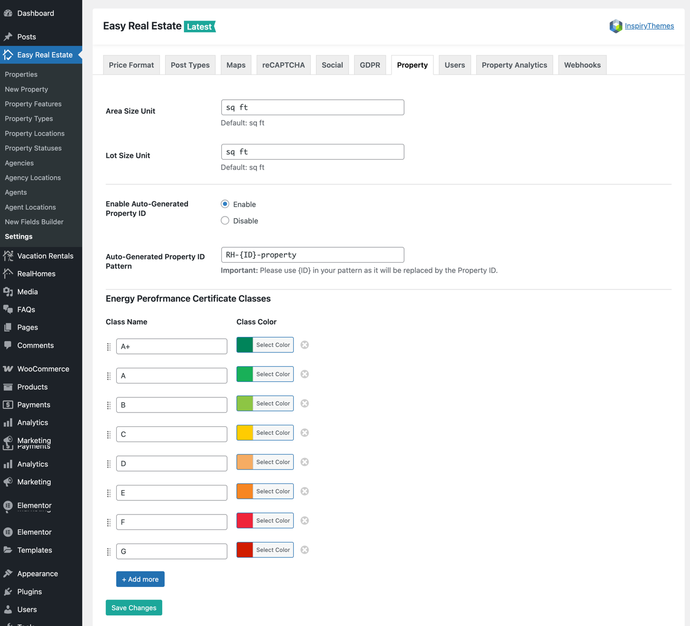

# Property Settings

There are some global settings available related to property post type. You can control the following settings in **Easy Real Estate → Settings → Property**.

- **Global Area Unit Size**
- **Global Lot Size Unit**
- **Enable/Disable Auto-Generated Property ID**
- **Auto-Generated Property ID Pattern**
- **Energy Performance Certificate Classes**

