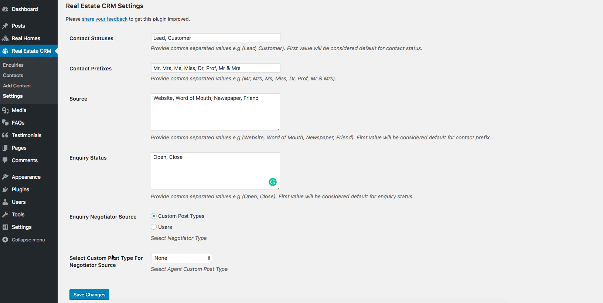
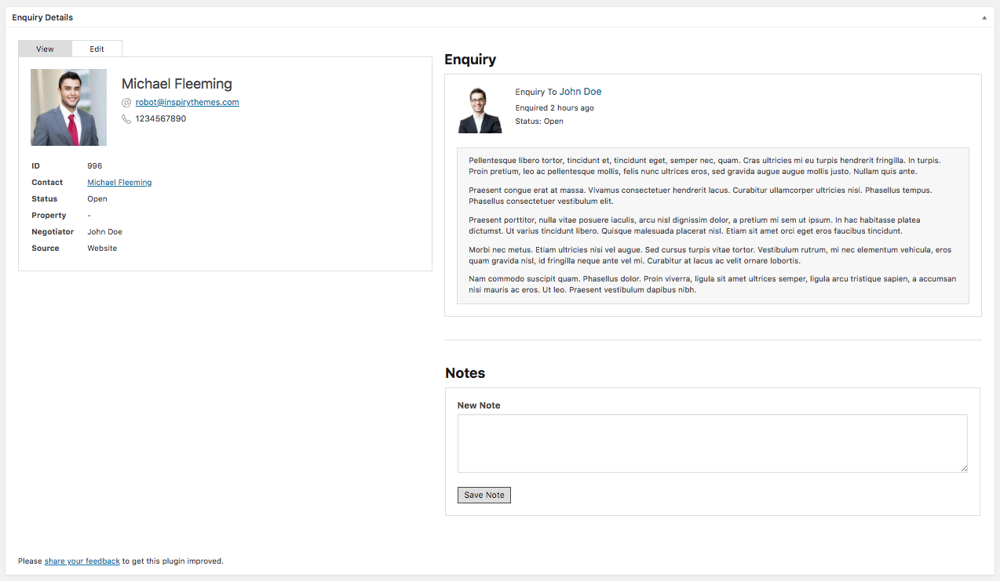
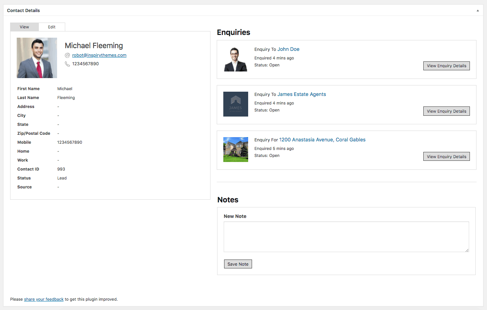
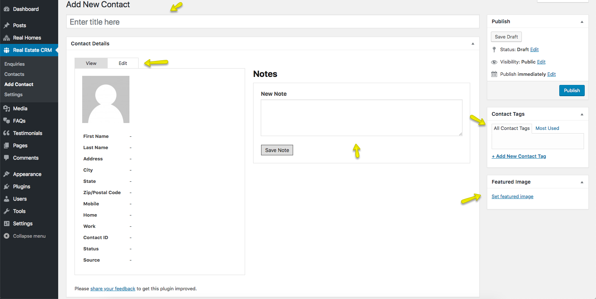

# Real Estate CRM Plugin

**Real Estate CRM (Customer Relationship Management) plugin** provides the ability to manage the enquiries of your customers. It has separate Enquiries and Contacts sections.

### **Settings**

Navigate to **Dashboard → Real Estate CRM → Settings** to change the settings. You can modify the following in this section.

- *Contact Statuses* - It will be the relationship type e.g. Lead, Customer, VIP or Partner etc.
 
- *Contact Prefixes* - Mr. Mrs etc.
 
- *Source Enquiry Status* - It can be Open, Close, Pending, Ongoing etc.
 
- *Enquiry Negotiator Source* - You have to define the source for negotiation e.g. Custom Post Type or Users.

- *Select Custom Post Type For Negotiator Source* - If choosen Custom Post Type then you will have to select the Post Type e.g. Agents or other as a source.

### **Enquiries**

The Enquiries section will display all the enquiries submitted by any type of form (contact form, agent contact form etc.) throughout your website in **Dashboard → Real Estate CRM → Enquiries**. When you click on **Enquiry ID** you will have the following view where you can see all the enquiry by a single customer.

### **Contacts**

All the contacts are found in **Dashboard → Real Estate CRM → Contacts**. Click on Contact ID will give you access to the changing the details for each contact.

### **Add New Contacts**

- You can add a new contact to the **CRM** by navigating to **Dashboard → Real Estate CRM → Add New**.

