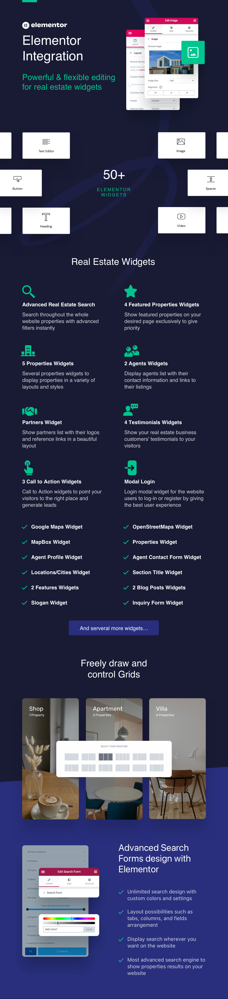

# Create Pages with RealHomes using Elementor Page Builder

Since version 3.8.0, you get Elementor Page Builder with RealHomes Theme main package, so you can add the content easily using Elementor Page Builder.

It comes with **52 Custom Elementor Widgets** of RealHomes Theme, which means you will find 52 **RealHomes Widgets** in Elementor's panel with lots of customizable options and settings.

If you are unfamiliar with **Elementor Page Builder**, you can check out their [getting started guide](https://docs.elementor.com/collection/1-getting-started).

## Use Real Homes Elementor Widgets in any Design

The great thing is now you can add the elements of Modern or Classic Design anywhere despite the Design you are using. For example, you can add Classic Properties Grid to Modern Design or vice versa using Elementor.