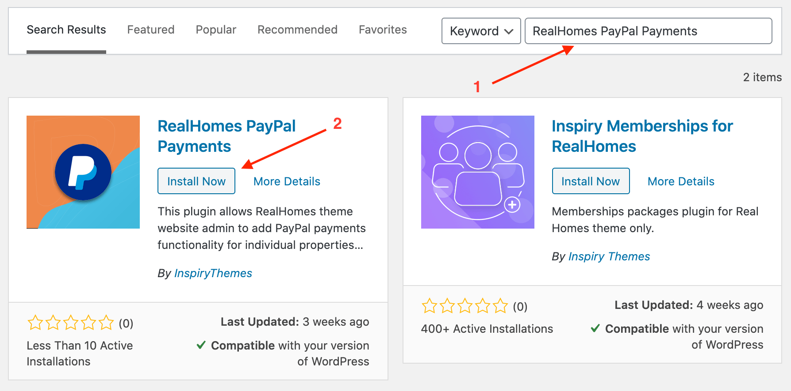
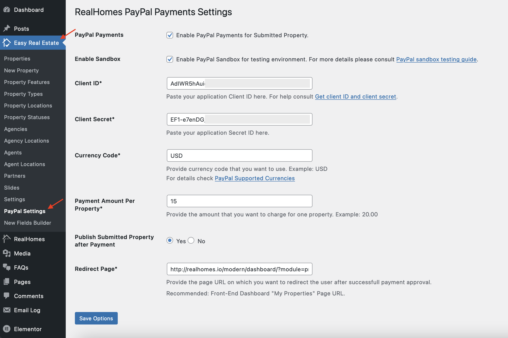

# Individual Property Payments Via PayPal

To enable PayPal payments for individual properties, install and configure the [RealHomes PayPal Payments](https://wordpress.org/plugins/realhomes-paypal-payments/) plugin. 

!!!important "Prerequisite"
	Before starting, ensure the **RealHomes theme** and its **Easy Real Estate plugin** are installed and activated.

## Install & Activate 'RealHomes PayPal Payments' Plugin

1. Navigate to **Dashboard → Plugins → Add New** and search for **RealHomes PayPal Payments**. 
	
	

2. **Install** and **Activate** the plugin.

## Configure Plugin Settings

1. Navigate to the PayPal settings page based on your version:

=== "v4.5.1 and Later"

    !!! success "RealHomes Settings"
        Dashboard ➤ RealHomes ➤ Settings ➤ PayPal Settings

=== "v4.5.0 and Earlier"

    !!! info "Legacy Settings"
        Dashboard ➤ Easy Real Estate ➤ PayPal Settings

	

This page contains the following settings:
	
	- Enable/Disable PayPal Payments.
	- Enable/Disable PayPal Sandbox Mode for testing.
	- PayPal account API Keys.
	- Currency Code.
	- Payment Amount Per Property.
	- Publish Submitted Property after Payment.
	- Redirect Page (after successful payment).
	
1. Configure all settings as per your preferences. For help retrieving your **Client ID** and **Client Secret**, refer to the [Retrieving the Client ID & Client Secret](https://inspirythemes.com/realhomes-memberships-setup/#retrieving-paypal-client-secret-id) section.

2. Once done, visit the *My Properties* page to view the PayPal payment button for individual properties.

	

!!!note
	In case of any issue, you can signup/login to our [support website](https://support.inspirythemes.com/login-register/) and [ask your question](https://support.inspirythemes.com/ask-question/).