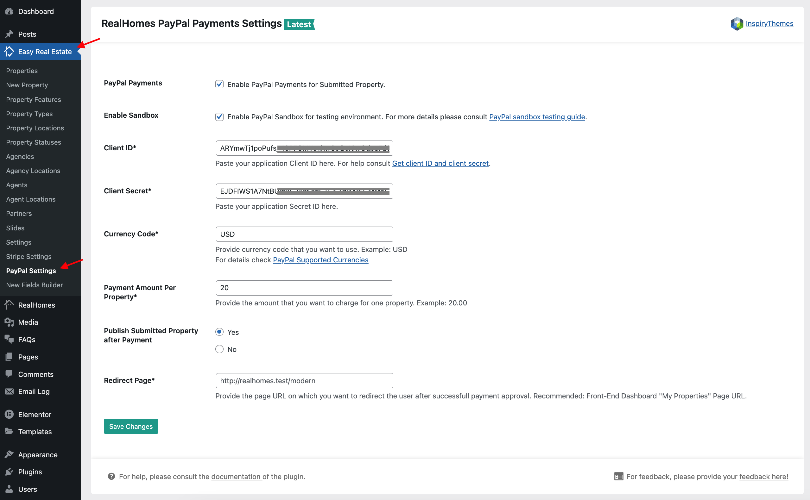

# Individual Property Payments Via PayPal

To enable PayPal payments for the individual properties you would need to install and configure the [RealHomes PayPal Payments](https://wordpress.org/plugins/realhomes-paypal-payments/) plugin. Plesae follow the steps given blow.

!!!important "Prerequisite"
	Before you start following the PayPal payments setup guide, please make sure the **RealHomes theme** and its **Easy Real Estate plugin** are installed and activated on your site.

## Install & Activate 'RealHomes PayPal Payments' Plugin

1. Navigate to **Dashboard → Plugins → Add New** and search for **RealHomes PayPal Payments** as displayed in the screenshot below: 
	
	

2. Once found, **Install** and **Activate** the plugin.

## Configure Plugin Settings

1. Navigate to **Dashboard → Easy Real Estate → PayPal Settings** page. This page contains the following settings.
	
	- Enable/Disable PayPal Payments.
	- PayPal account API Keys.
	- Payment Button Label.
	- Currency Code (in which you want to charge your users).
	- Payment Amount Per Property.
	- Publish Submited Property after Payment.
	- Redirect Page (after successfull PayPal payment).

	
2. Configure all the settings as per your preferences. For help to get your PayPal account **Client ID** and **Client Secret** you can follow [Retrieving the Client ID & Client Secret](https://inspirythemes.com/realhomes-memberships-setup/#retrieving-paypal-client-secret-id) section.

6. Once done, visit *My Properties* page on your website to view PayPal payment button for individual properties.

	

!!!note
	In case of any issue, you can signup/login to our [support website](https://support.inspirythemes.com/login-register/) and [ask your question](https://support.inspirythemes.com/ask-question/) over there.