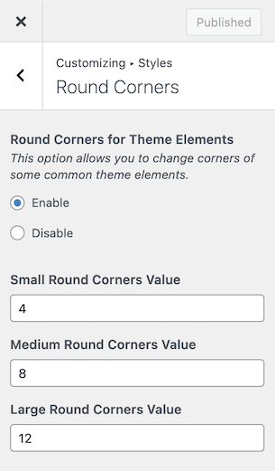
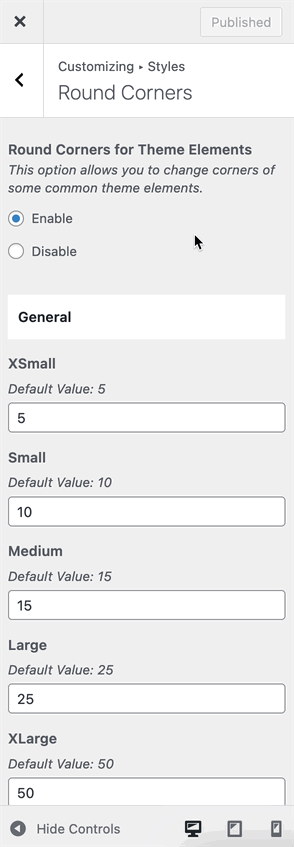

# How to enable Round Corners?

The settings to enable rounded corners throughout the theme is located in **Dashboard → RealHomes → Customize Settings → Styles → Round Corners**. This feature is available in Modern and Ultra design only.
### **Modern**

### **Ultra**

