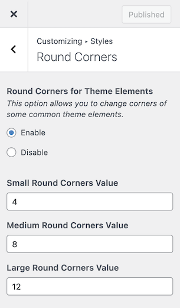
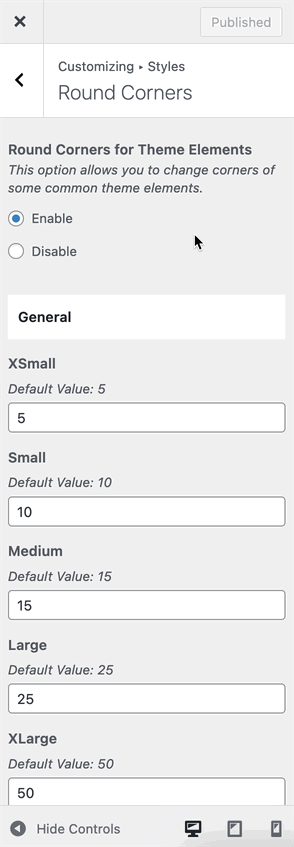

# How to enable Round Corners?

The settings to enable rounded corners throughout the theme can be found at:

=== "v4.5.1 and Later"

    !!! success "RealHomes Settings"
        Dashboard ➤ RealHomes ➤ Settings ➤ Styles ➤ Round Corners

=== "v4.5.0 and Earlier"

    !!! info "Legacy Settings"
        Dashboard ➤ RealHomes ➤ Customize Settings ➤ Styles ➤ Round Corners

    This feature is available in Modern and Ultra design only.

    ### **Modern**

    

    ### **Ultra**

    