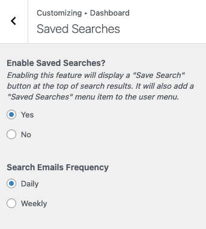
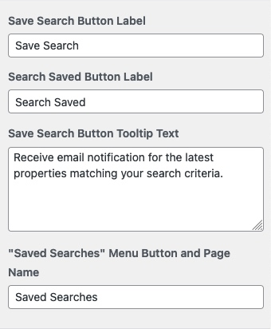
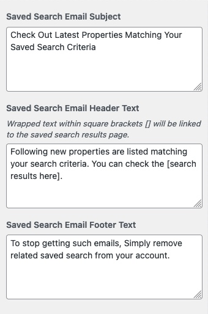
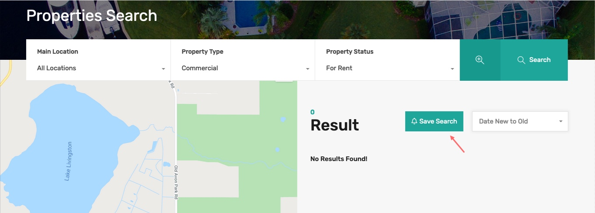
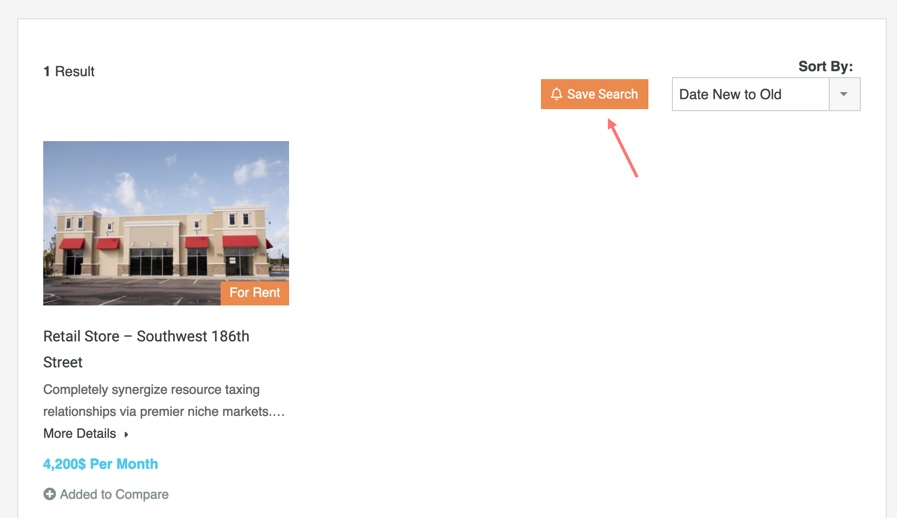
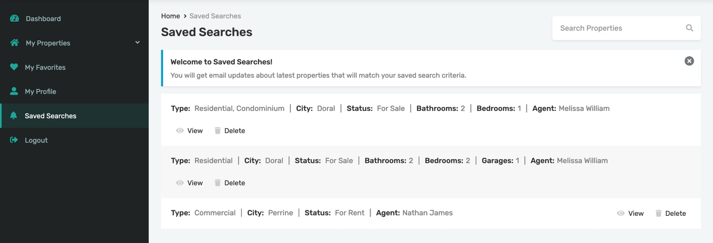
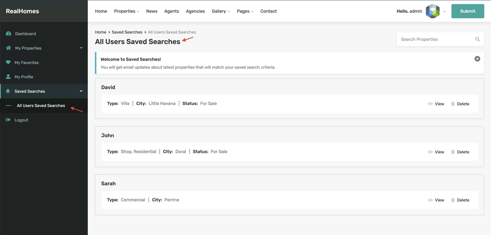

# Saved Searches

## Setup Saved Searches Feature

Enabling this feature will display a **Save Search** button at the top of search results. It will also add a **Saved Searches** menu item to the user menu.

Navigate to **Dashboard → RealHomes → Customize Settings → Dashboard → Saved Searches** section to enable/disable the save search feature and configure other related settings. 

**Modern**

**Classic**

## How Save Search Feature Works

- Any visiter can save searched criteria by clicking on the **Save Search** button.
- If user is not logged-in, then the saved searches will be stored to the browser’s local storage.
- If user is logged-in, then the saved searches will be stored in the database as user meta.
- Any saved searches that are stored to the local storage before logging-in will be migrated autometically to the logged-in user meta in the database.
- User will receive email notifications for the latest properties matching their saved searches criteria.
- The saved searches can be accessed through the **Saved Searches** dashaboard page, where user can view or delete them.

## How an Administrator can see All the Saved Searches by the Users

The website administrators can see all the saved searches of the users in the **User Dashboard** in "**All Users Saved Searches**" page.

