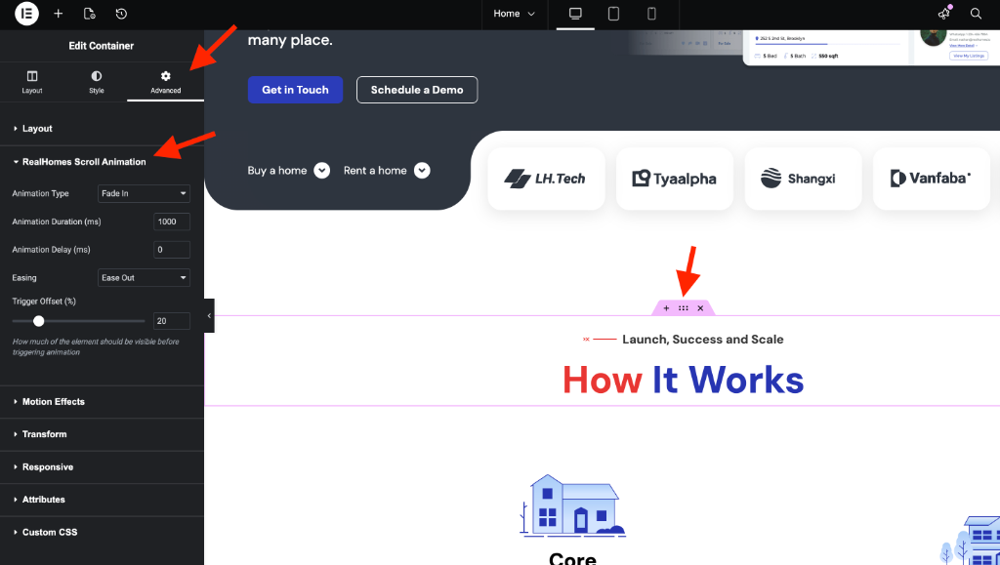

# RealHomes Scroll Animation

RealHomes introduces a built-in **Scroll Animation** feature for Elementor Containers, allowing you to add professional reveal effects as users scroll down your website.

---

### **How to Apply Scroll Animations**

Follow these steps to enable scroll animations on any Elementor Container:

1.  Open your page in the **Elementor Editor**.
2.  Click on the **Container** you wish to animate (represented by the six-dot icon).
3.  In the left sidebar, navigate to the **Advanced** tab.
4.  Locate and expand the **RealHomes Scroll Animation** section.

---

### **Animation Settings**

Once the section is expanded, you can customize the following properties:

*   **Animation Type**: Choose the style of animation (e.g., **Fade In**, **Slide Up**, **Zoom In**, etc.).
*   **Animation Duration (ms)**: Define how long the animation takes to complete in milliseconds (Default: `1000`).
*   **Animation Delay (ms)**: Set a delay before the animation starts once triggered (Default: `0`).
*   **Easing**: Control the acceleration and deceleration of the animation (e.g., **Ease Out**, **Linear**, **Ease In Out**).
*   **Trigger Offset (%)**: Determine how much of the element must be visible in the viewport before the animation triggers. For example, `20` means the animation starts when 20% of the container is on screen.

---

!!! tip "Performance Note"
    While scroll animations add visual flair, we recommend using them selectively on key sections to maintain optimal page loading speed and a smooth user experience.
