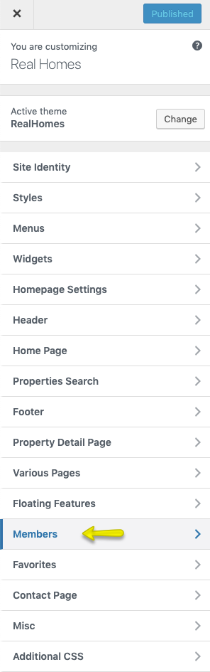

# Set Up Edit Profile Page

> Note: If you have imported the demo contents XML then Edit Profile page is already created. But you still need to configure related settings as guided near the end of this section.

To add Edit Profile page, Go to **Dashboard → Pages → Add New**

- Provide the page title 

- Select the **Edit Profile** template from page attributes.

- Publish the page once it is ready.

- Now you need to navigate to **Dashboard → Real Homes → Customize Settings** and look for **Members** panel. This panel contains **Edit Profile** section where you can configure related settings.

- Save the changes and your **Edit Profile** page is ready to use.

