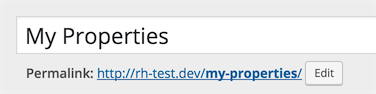
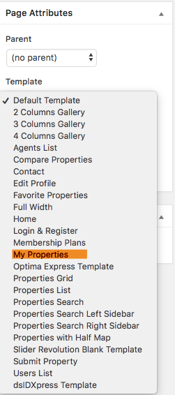
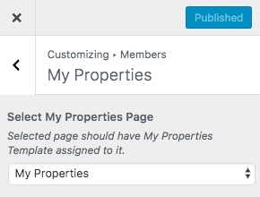

# Set Up My Properties Page

> Note: If you have imported the demo contents XML then My Properties page is already created. But you still need to configure related settings as guided below.

To add My Properties page, Go to **Dashboard → Pages → Add New**

- Provide the page title
 

- Select the **My Properties** template from page attributes.

- Publish the page once it is ready.

- Now you need to navigate to **Dashboard → Real Homes → Customize Settings** and look for Members panel. This panel contains My Properties section where you can configure related settings. **Select My Properties** page from dropdown as displayed in above screenshot.

- Save the changes and your My Properties page is ready to use. 

