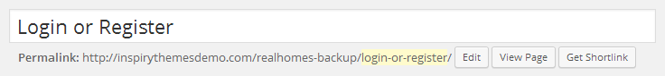
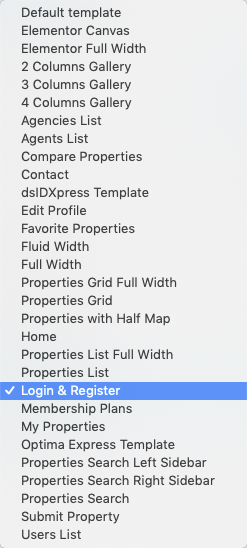
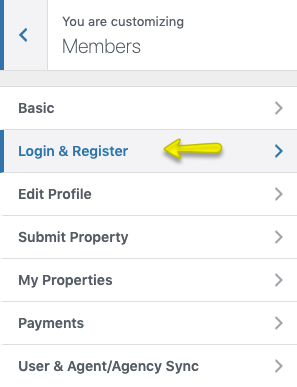

# Set Up Login & Register

To allow user registration, You need to allow registration from Settings → General as displayed in screen shot below. Otherwise you will only have login form available for use.

> IMPORTANT: Since Version 1.6 Real Homes theme automatically provides modal dialog for Login and Registeration. So you do not need to follow further details of this section.

### Create Login & Register Page

> Note: If you have imported the demo contents XML then Login & Register page is already created. But you still need to configure related settings as guided near the end of this section.

To add Login & Register page, Go to **Dashboard → Pages → Add New**

- Provide the page title

- Select the **Login & Register Template** from page attributes.
 

- Provide the top banner related information 

- Publish the page once it is ready.

### Configure Related Settings

- Now you need to go to **Dashboard → Real Homes → Customize Settings** and look for Members panel.

- Look for Login & Register Section in that panel.

- Now copy the Login & Register page URL and paste it in settings displayed below.

That's it your Login & Register page is ready for use.
