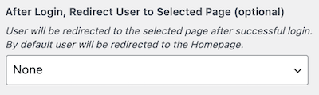

# Setup Login

## Login Dialog Box Options

You can customize the login dialog box. The settings are found in **Dashboard → RealHomes → Customize Settings → Header  → Login & Register**. 

!!! note
    Dialog box will appear if no page is selected in **Dashboard → RealHomes → Customize Settings → Header → Login & Register** ==Login and Register Page (optional)== field.
    

You can also customize the login dialog box labels and placeholders text. The settings are found in **Dashboard → RealHomes → Customize Settings → Header  → Login & Register**. 

## Redirect Users after Login

You can also redirect the users once they have logged in. The settings are found in **Dashboard → RealHomes → Customize Settings → Header  → Login & Register**.

Now select the page where you like the users to redirect to.

