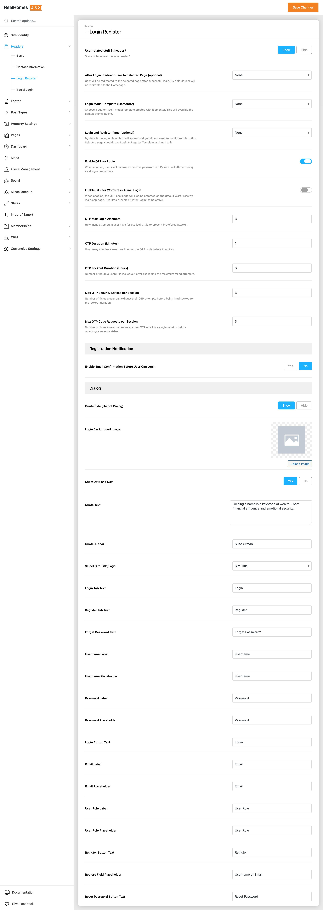
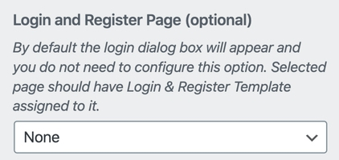
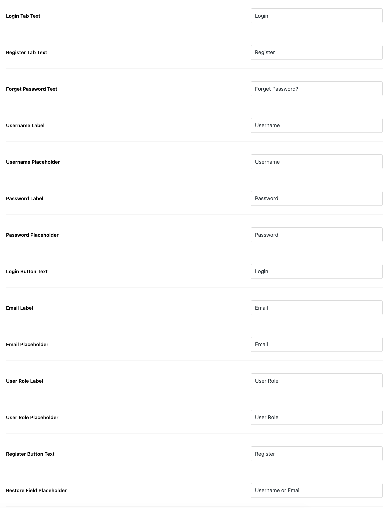
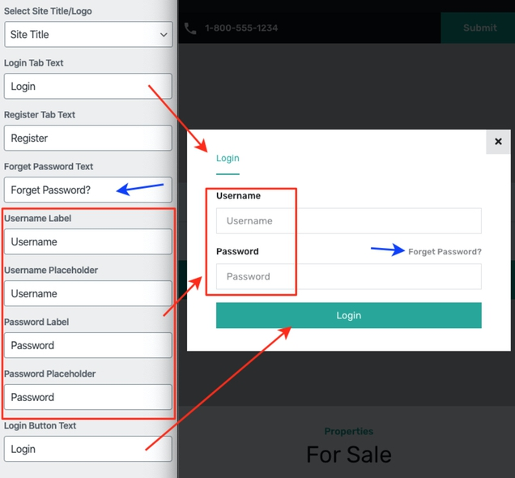
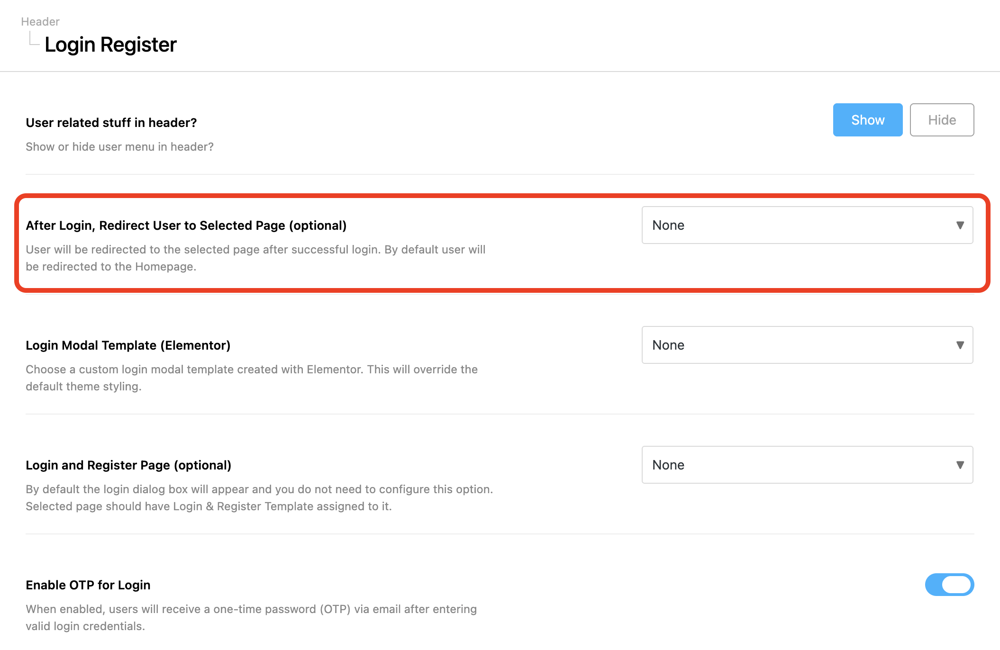
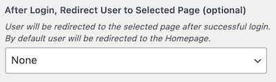

# Setup Login

## Login Dialog Box Options

You can customize the login dialog box. Follow the navigation path based on your version of the **RealHomes** theme:

=== "v4.5.1 and Later"

    !!! success "RealHomes Settings"
        Dashboard ➤ RealHomes ➤ Settings ➤ Headers ➤ Login & Register

    

=== "v4.5.0 and Earlier"

    !!! info "Legacy Settings"
        Dashboard ➤ RealHomes ➤ Customize Settings ➤ Header ➤ Login & Register

    

!!! note
    Dialog box will appear if no page is selected in the **Login and Register Page (optional)** field.
    

You can also customize the login dialog box labels and placeholders text in the same section.

=== "v4.5.1 and Later"

    !!! success "RealHomes Settings"
        Dashboard ➤ RealHomes ➤ Settings ➤ Headers ➤ Login & Register

    

=== "v4.5.0 and Earlier"

    !!! info "Legacy Settings"
        Dashboard ➤ RealHomes ➤ Customize Settings ➤ Header ➤ Login & Register

    

## Redirect Users after Login

You can also redirect the users once they have logged in. The settings are found in the same **Login & Register** section mentioned above.

Now select the page where you like the users to redirect to.

=== "v4.5.1 and Later"

    !!! success "RealHomes Settings"
        Dashboard ➤ RealHomes ➤ Settings ➤ Headers ➤ Login & Register

    

=== "v4.5.0 and Earlier"

    !!! info "Legacy Settings"
        Dashboard ➤ RealHomes ➤ Customize Settings ➤ Header ➤ Login & Register

    