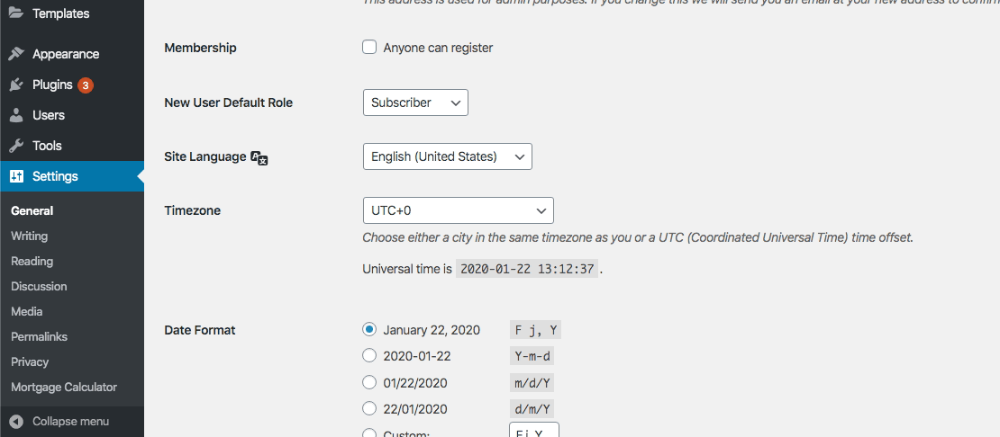
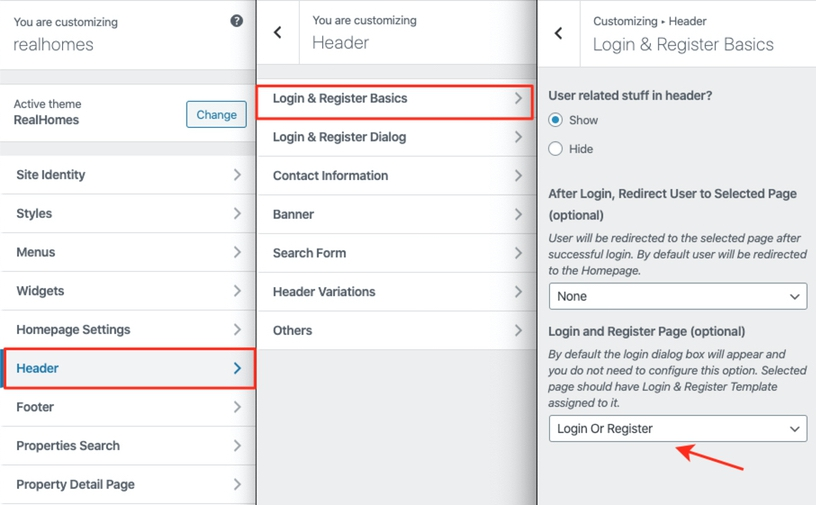

# Setup Registration

## Allow Registration

To allow user registration, you need to check the **Anyone can register** option from **Dashboard → Settings → General** page and *Save Changes* as displayed in the following screenshot. Otherwise only Login form will be available for the users.

## Restrict Backend Access

You must restrict backend access of the user level which you have setup in the previous setup. So navigate to **Dashboard → Real Homes → Customize Settings → Users & Members → Basic** and select **Contributor** (or the user role you have selected) for the first option (shown in the following screenshot).

## Create Login & Register Page

!!! note
    If you have imported demo contents then Login & Register page might already be created. But you still need to configure related settings as guided near the end of this section.

To add Login & Register page, Go to **Dashboard → Pages → Add New**

Provide the page title

Select the **Login & Register** template from page attributes.
 

Provide the top banner related information 

**Classic**

**Modern**

!!!info "More information about **Banner Settings** can be found here: "
    **https://support.inspirythemes.com/knowledgebase/how-to-configure-the-banner-settings/**

Publish the page once it is ready.

## Configure Settings

Now you need to go to **Dashboard → Real Homes → Customize Settings -> Header** and go to **Login & Register Basics** section.

Now select the **Login Or Register** page that has been created earlier as shown in image below.

Publish the settings and your **Login & Register** page is ready for use.