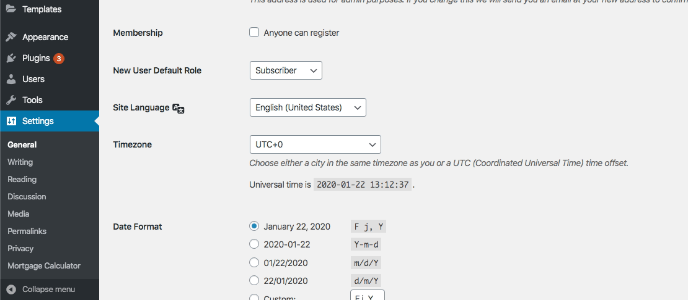
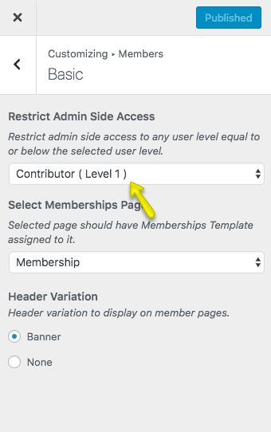
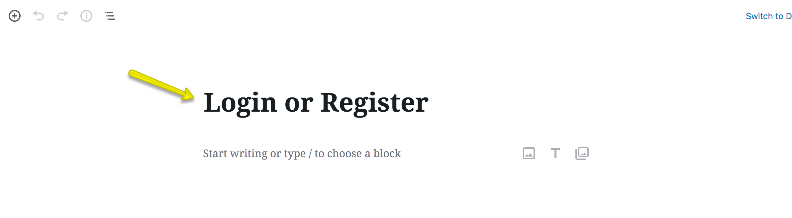
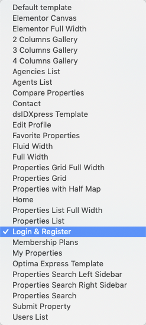
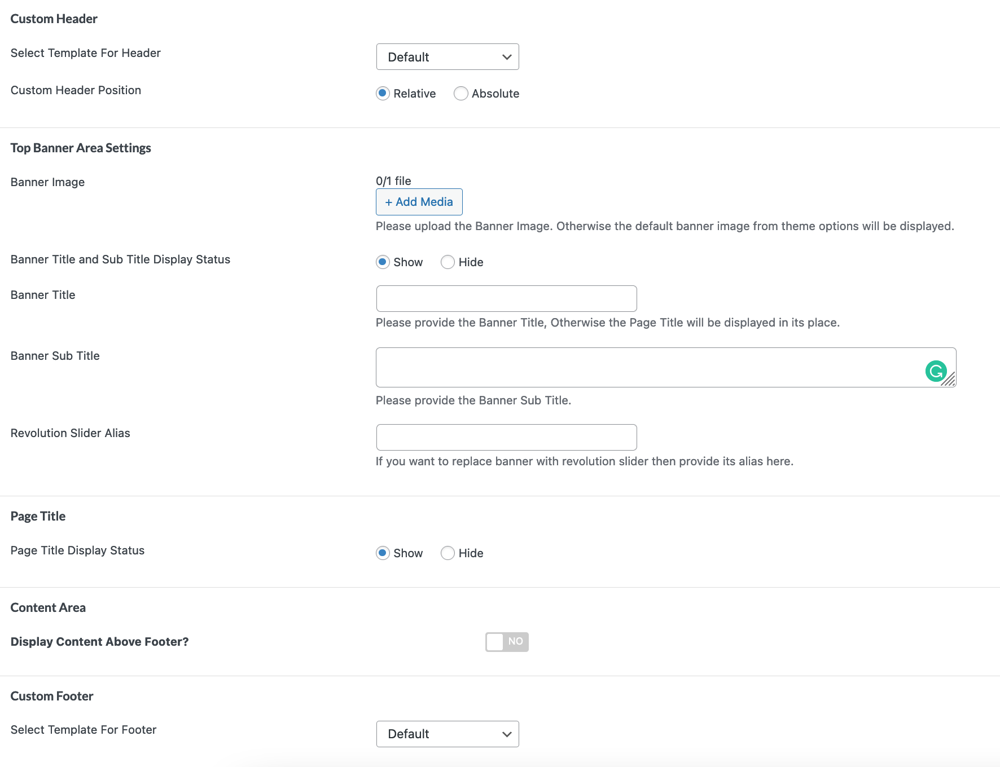
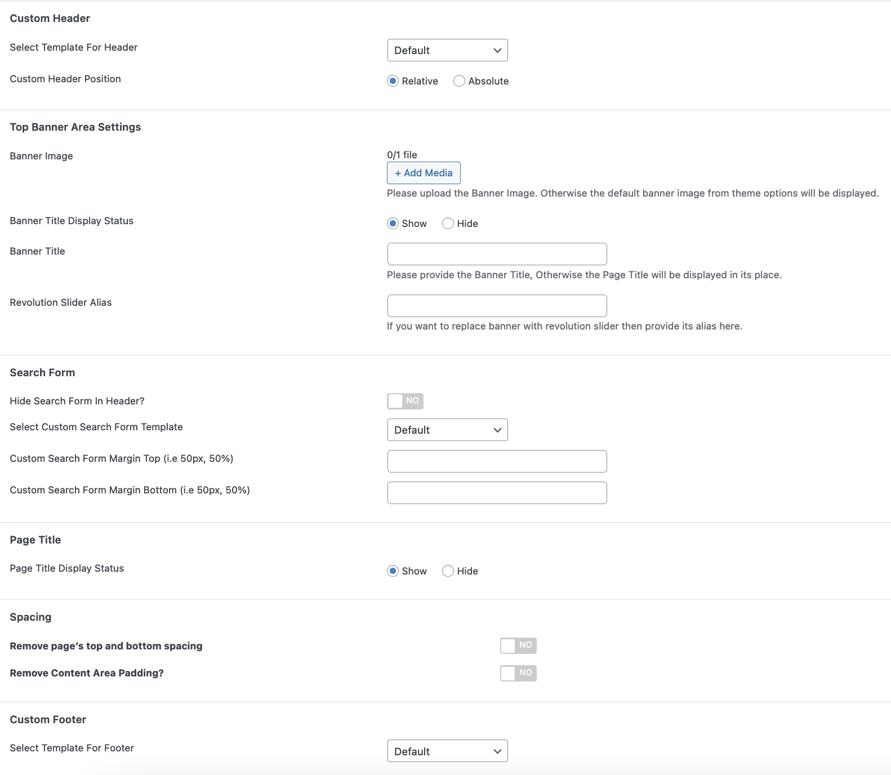
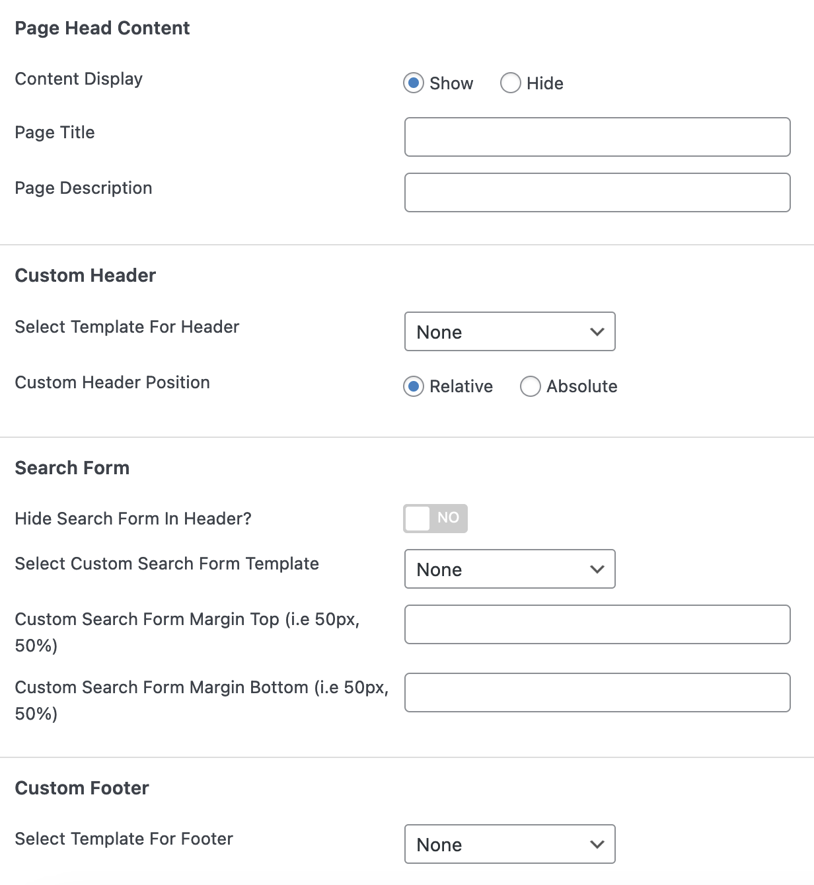
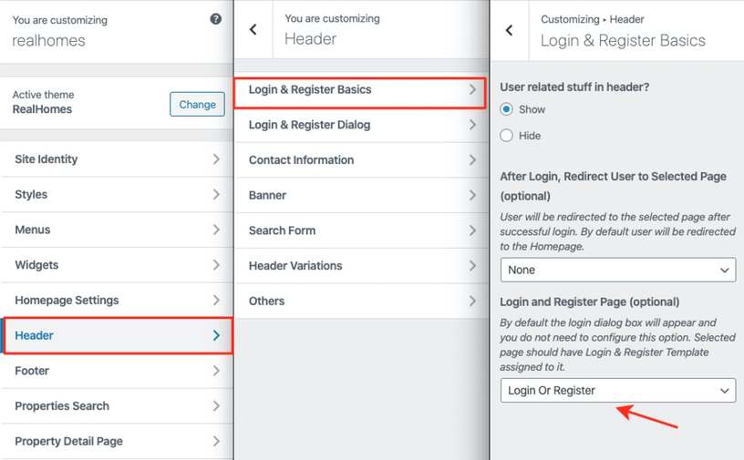

# Setup Registration

## Allow Registration

To allow user registration, you need to check the **Anyone can register** option from **Dashboard → Settings → General** page and *Save Changes* as displayed in the following screenshot. Otherwise only Login form will be available for the users.

## Restrict Backend Access

You must restrict backend access of the user level which you have setup in the previous setup. Navigate based on your version of the **RealHomes** theme:

=== "v4.5.1 and Later"

    !!! success "RealHomes Settings"
        Dashboard ➤ RealHomes ➤ Settings ➤ Dashboard ➤ Basic

=== "v4.5.0 and Earlier"

    !!! info "Legacy Settings"
        Dashboard ➤ RealHomes ➤ Customize Settings ➤ Dashboard ➤ Basic

    

## Create Login & Register Page (Optional)

!!! note
    If you have imported demo contents then Login & Register page might already be created. But you still need to configure related settings as guided near the end of this section.

To add Login & Register page, Go to **Dashboard → Pages → Add New**

Provide the page title

Select the **Login & Register** template from page attributes.
 

Provide the top banner related information 

**Classic**

**Modern**

**Ultra**

!!!info "More information about **Banner Settings** can be found here: "
    **https://support.inspirythemes.com/knowledgebase/how-to-configure-the-banner-settings/**

Publish the page once it is ready.

## Configure Settings

Now you need to configure the created page in your theme settings. Navigate based on your version:

=== "v4.5.1 and Later"

    !!! success "RealHomes Settings"
        Dashboard ➤ RealHomes ➤ Settings ➤ Headers ➤ Login & Register

=== "v4.5.0 and Earlier"

    !!! info "Legacy Settings"
        Dashboard ➤ RealHomes ➤ Customize Settings ➤ Header ➤ Login & Register Basics

    Now select the **Login Or Register** page that has been created earlier as shown in image below.

    

Publish the settings and your **Login & Register** page is ready for use.