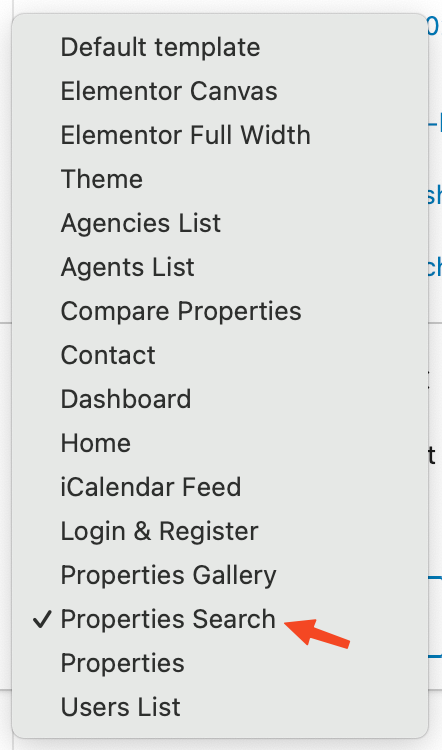

## Configure Property Search in Ultra Design

Before starting with this section, Make sure you have pretty permalinks enabled from **Dashboard → Settings → Permalinks** and Property Search Page is created.

## Create Property Search Page

Create a new page "**Property Search**" Using **Property Search Template** ( In case of Imported XML this page is already created ). 
Other search templates with sidebar support are also available to use.

!!! Warning
    Make sure that the slug of this page should not be "**yourwebsite.com/search/**" because that will conflict with internal WordPress search and create issues for your website.

## Setup Search Page in Customizer

After the creation of search page, you must set it up as search results page by assigning the newly created search page in **Select Search Page** option in **Customizer** settings in **Dashboard → RealHomes → Customize Settings → Properties Search → Properties Search Page**.

