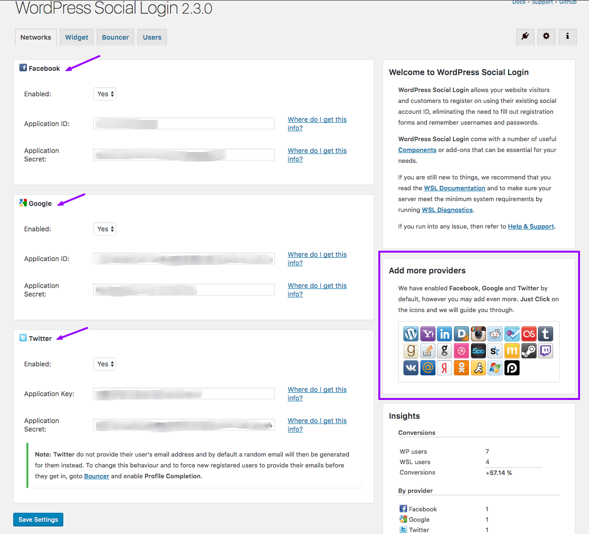
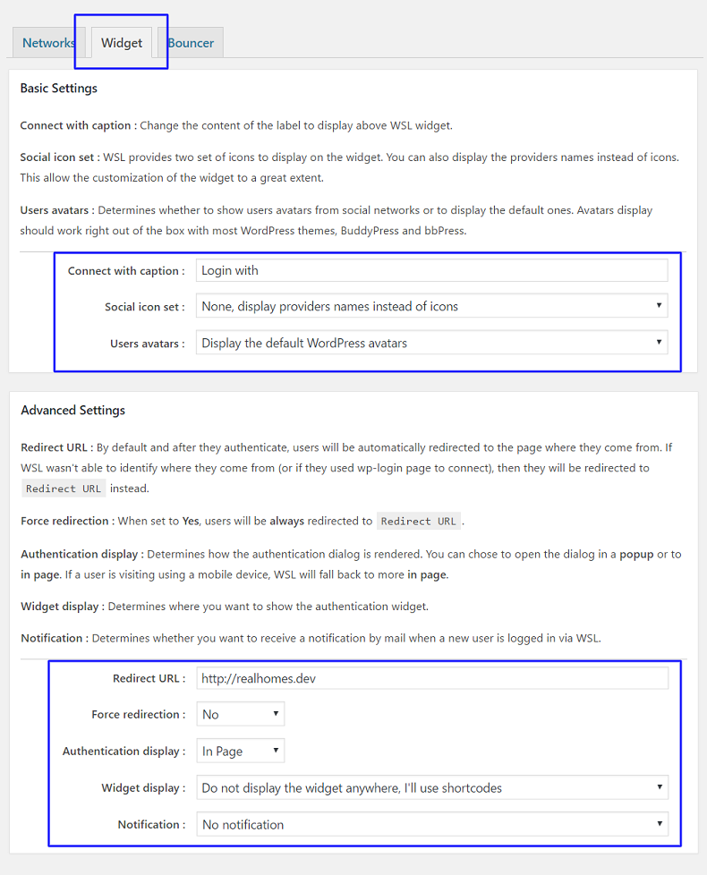
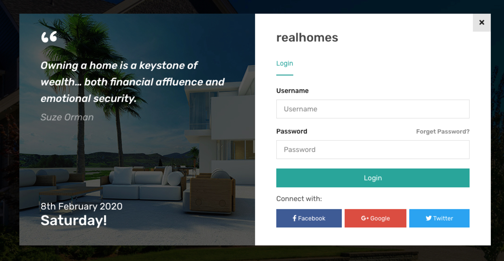

# Setup Social Login

!!! note
        Social Login feature is now available in both Classic and Modern designs.

**Install** and **Activate** [WordPress Social Login plugin](https://wordpress.org/plugins/wordpress-social-login/).

[Click here to download zip file](https://github.com/jobstertheme/wordpress-social-login/archive/master.zip)

After activation, go to plugin settings and configure those for your desired social networks, As displayed in screenshot below. 

Also make sure to configure widget settings as recommended below. 

Once configurations are done, You can check your login form and social login options will appear below it. 

