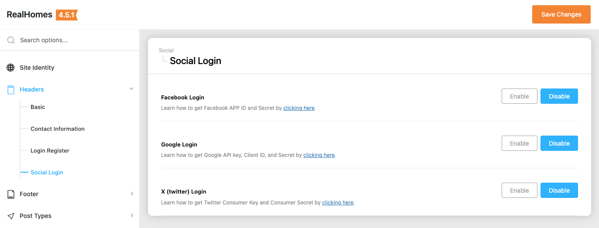

# Setup Social Login

RealHomes supports social login via **Facebook**, **Google**, and **Twitter**, allowing users to register and log in quickly using their social profiles.

### **Social Login Guide**

We have prepared a detailed blog post to cover the technical setup (API keys, App IDs, etc.) for each platform:

<a class="setup-btn" target="_blank" href="https://inspirythemes.com/realhomes-social-login-setup/">SOCIAL LOGIN SETUP GUIDE</a>

---

### **Configuring Social Login in RealHomes**

To enable and configure social login settings in the theme, follow the path based on your version:

---

#### **v4.5.1 and Later**

!!! info "Navigation Path"
    **Dashboard** → **RealHomes** → **Settings** → **Miscellaneous** → **Social Login** (tab)

---

#### **v4.5.0 and Earlier**

!!! info "Navigation Path"
    **Dashboard** → **Easy Real Estate** → **Settings** → **Social Login** (tab)

---

1.  Enable the social login platforms you wish to use.
2.  Paste the required API keys/credentials obtained from the respective developer platforms.
3.  Click **Save Changes**.