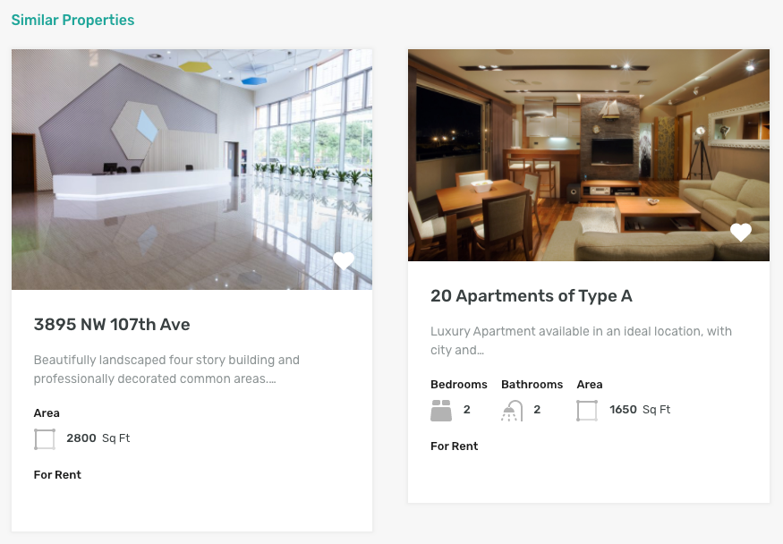

# Similar Properties on Property Detail Page

**Similar Properties Settings** are located in **Dashboard → Appearance → Customize → Property Detail Page → Similar Properties**.

* Just like all other settings for property detail page's elements you can choose to display the similar properties section on property detail page or hide it.
* You can also select how similar properties will be selected based on their features, types, locations and status.
* You can also sort the similar properties according to your own choice.

