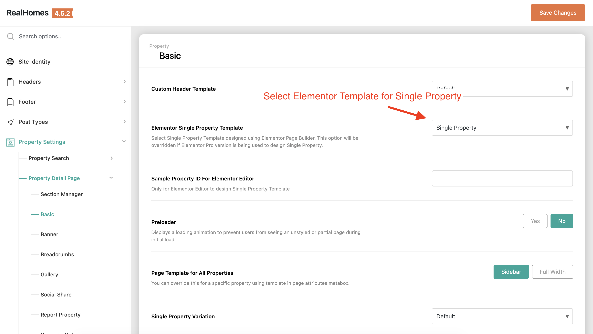
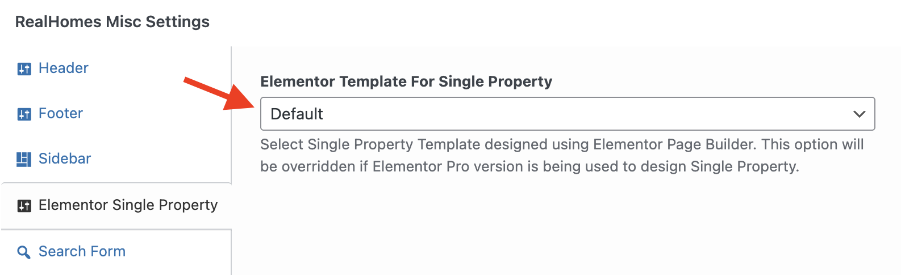

## Setup Single Property Page with Elementor in Modern

With the release of v4.5.3, RealHomes provides full support for designing and applying Elementor-based templates to single property pages in the Modern design. You can import pre-designed single property templates or build your own custom layout from scratch.

---

### ⚙️ Configure the Template Settings

To apply a template globally to all property detail pages:

=== "v4.5.3 and Later"

    !!! success "RealHomes Settings"
        1. Navigate to **Dashboard ➤ RealHomes ➤ Settings ➤ Property Detail Page ➤ Basic**.
        2. From the **Elementor Single Property Template** select dropdown, choose your desired template.  
        
        3. In the **Sample Property ID for Elementor Editor** field, enter the post ID of a published property to serve as a preview.

📌 *Note: Some RealHomes widgets are dynamic and may not fully render within the Elementor editor. To verify changes, save your layout and preview a property page on the frontend.*

---

### 🔄 Overriding Templates on a Per-Property Basis

You can assign different Elementor templates to individual properties using the property edit screen:

1. Edit a property under **Dashboard ➤ Properties ➤ All Properties**.
2. Scroll down to the **RealHomes Misc Settings** meta box and select the **Elementor Single Property** tab.
3. Choose the specific template under the **Elementor Template For Single Property** dropdown.  


---

### ✏️ Design Your Own Single Property Layout

If you prefer to design a custom template from scratch, you can register a new template in the Elementor Library and compose it using the dedicated RealHomes Single Property widgets.

#### Available Modern (V2) Widgets

When editing single property templates in Elementor, look under the **RealHomes Ultra Single Property** widgets category (or search for `V2` or `RH:`) to find the following custom Modern widgets:

- **RH: Single Property Meta V2** — Displays rooms, baths, garages, area, lot size, etc.
- **RH: Single Property Description V2** — Renders the main property description content.
- **RH: Single Property Additional Details V2** — Lists custom key-value details of the property.
- **RH: Single Property Features V2** — Lists checked features/amenities.
- **RH: Single Property Map V2** — Integrates Google Maps, OpenStreetMap, or Mapbox.
- **RH: Single Property Video V2** — Embeds property video tours.
- **RH: Single Property Virtual Tour V2** — Renders 360-degree virtual tours.
- **RH: Single Property Floor Plans (V2, V3, V4)** — Displays interactive floor plans.
- **RH: Single Property Attachments V2** — Provides downloadable file attachments.
- **RH: Single Property Common Note V2** — Displays disclaimer or notes.
- **RH: Single Property Similar Properties V2** — Shows related properties.
- **RH: Single Property Agent V2** — Displays assigned agent details.
- **RH: Single Property Agency V2** — Displays assigned agency details.
- **RH: Single Property Schedule Tour V2** — Integrates tour scheduling contact forms.
- **RH: Single Property Mortgage Calculator V2** — Financial calculation widget.
- **RH: Comments V2** — Renders WordPress comments for the property.

---

### 🛠️ Developer Reference

Under the hood, RealHomes queries the global template setting using the WordPress core function [get_option()](https://developer.wordpress.org/reference/functions/get_option/) and specific property overrides via [get_post_meta()](https://developer.wordpress.org/reference/functions/get_post_meta/).

The theme conditional loader in `assets/modern/partials/property/single.php` uses [do_action()](https://developer.wordpress.org/reference/functions/do_action/) to trigger the following action hook to output the Elementor template content:

```php
do_action( 'realhomes_elementor_single_property_content' );
```
