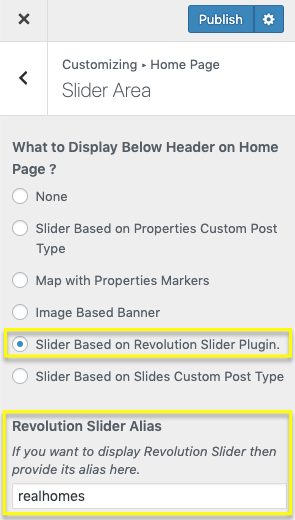

# Revolution Slider
### **Import Real Homes Slider for Revolution Slider**

After Revolution Slider installation and activation please navigate to **Dashboard → Slider Revolution** and click on **Import Slider** as shown in this screenshot below. The zip file of the slider is located in the main package of RealHomes Theme (**rh-main-package → Plugins → Revolution Slider → realhomes-slider-zip → realhomes.zip**).

Once the slider is imported then set it in the **Customizer Settings** (**Dashboard → Real Homes → Customize Settings → Home Page → Slider Area → What to Display Below Header on Home Page ?** and set this option as **Slider Based on Revolution Slider Plugin** and set **Revolution Slider Alias** as **realhomes**.

**Classic**

**Modern**

