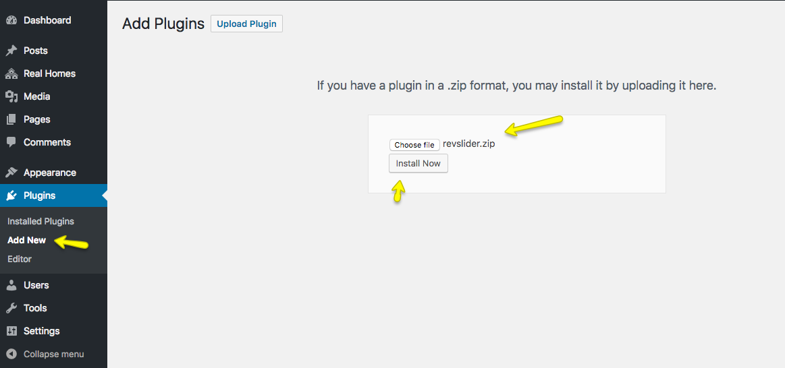
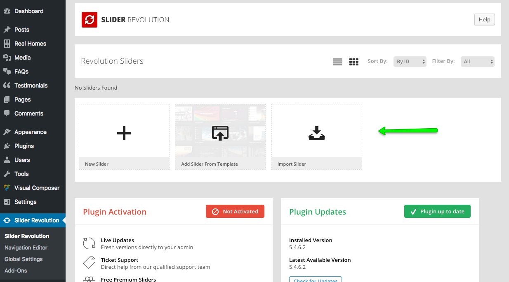

# Revolution Slider

!!! info "Important Notice"
    #### **Slider Revolution Compatibility & Versioning**
    **RealHomes is fully compatible with the new Slider Revolution 7.x engine.**

    To ensure a seamless experience, **RealHomes continues to bundle a stable and fully compatible version of Slider Revolution** within the main theme package. This version is specifically tested and maintained to work perfectly with all RealHomes features and layouts. We highly recommend using this bundled version to avoid any interface or performance issues.

    #### **Support Policy**
    Please be aware that while we include Slider Revolution for your convenience, we provide limited support for its advanced settings and custom slider creation. Our support is focused on its integration with RealHomes and ensuring the bundled version operates as intended within the theme.

    #### **Addons Compatibility**
    Please note that certain Slider Revolution addons, particularly those developed for newer plugin versions, may not be compatible with the stable bundled version included in RealHomes. We recommend verifying compatibility before attempting to use additional Slider Revolution addons.

### **How to Install Slider Revolution**

There are two ways to install the Slider Revolution plugin on your website:

#### **Method 1: Via RealHomes Dashboard (Convenient Way)**
The easiest way to install Slider Revolution is through the theme's integrated plugin manager.

1.  Navigate to **Dashboard → RealHomes → Plugins**.  
2.  Find **Slider Revolution** in the list and click **Install**.  
3.  Once installed, click **Activate**.

#### **Method 2: Manual Installation from Theme Package**

If you prefer to install it manually, you can find the plugin within the main theme package.  
1.  Download the full package called **rh-main-package.zip** from ThemeForest and extract it.  
2.  Locate the folder: **Plugins/Revolution Slider**.  
3.  This folder contains the **revslider.zip** file.  
4.  Go to **Plugins → Add New → Upload Plugin** in your WordPress dashboard and upload **revslider.zip**.

### **Import RealHomes Slider for Revolution Slider**

After Revolution Slider installation and activation please navigate to **Dashboard → Slider Revolution** and click on **Import Slider** as shown in this screenshot below. The zip file of the slider is located in the main package of RealHomes Theme (**rh-main-package → Plugins → Revolution Slider → realhomes-slider-zip → realhomes.zip**).

Once the slider is imported then set it in the **Customizer Settings** (**Dashboard → RealHomes → Customize Settings → Home Page → Slider Area → What to Display Below Header on Home Page ?** and set this option as **Slider Based on Revolution Slider Plugin** and set **Revolution Slider Alias** as **realhomes**.

