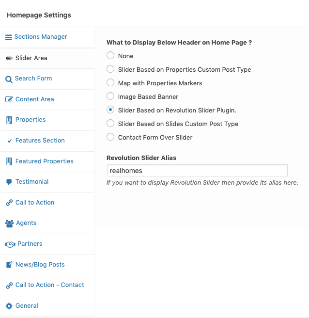

# Revolution Slider

### **Install Revolution Slider**

Download full package called **rh-main-package.zip** of RealHomes theme from ThemeForest.net (using your account) and extract it. You can find the instructions to download the full package [here](https://realhomes.io/documentation/installation-and-activation/).

Once extracted find the folder called **Plugins/Revolution** Slider in unzipped package downloaded from themeforest.net.

This folder will contain revolution slider's plugin zip, documentation and demo slider import zip. You need to go to **Plugins → Add New** in your WordPress dashboard side and upload the **revslider.zip** as displayed in image below.

### **Import Real Homes Slider for Revolution Slider**

After Revolution Slider installation and activation please navigate to **Dashboard → Slider Revolution** and click on **Import Slider** as shown in this screenshot below. The zip file of the slider is located in the main package of RealHomes Theme (**rh-main-package → Plugins → Revolution Slider → realhomes-slider-zip → realhomes.zip**).

Once the slider is imported then set it in the **Customizer Settings** (**Dashboard → Real Homes → Customize Settings → Home Page → Slider Area → What to Display Below Header on Home Page ?** and set this option as **Slider Based on Revolution Slider Plugin** and set **Revolution Slider Alias** as **realhomes**.

