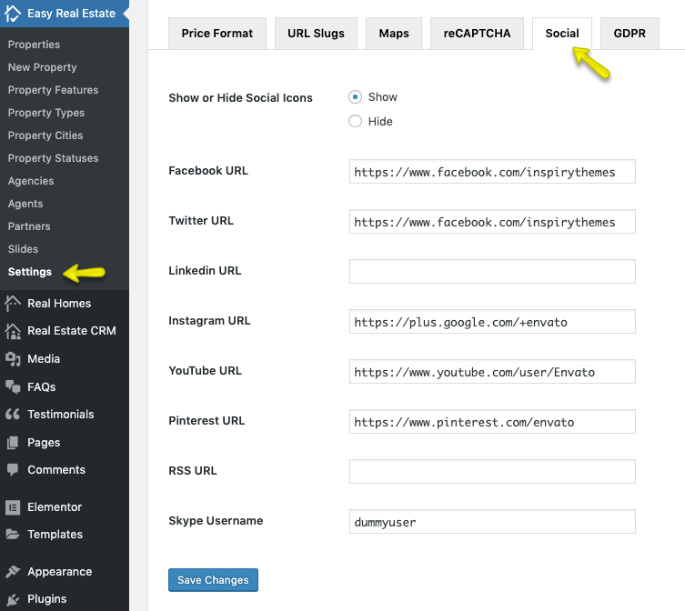
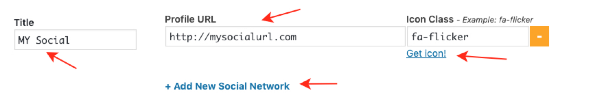

# Social Icons Settings

Navigate to **Easy Real Estate → Settings → Social** to change social links settings. You can also Show/Hide all social icons without changing social links values.

!!! info "Important Information"
    If you are running the RealHomes Theme older than {==3.9.0==} version then related settings can be found by navigating to **Dashboard → RealHomes → Customize Settings → Social Links**

##Add New Social Icons##

